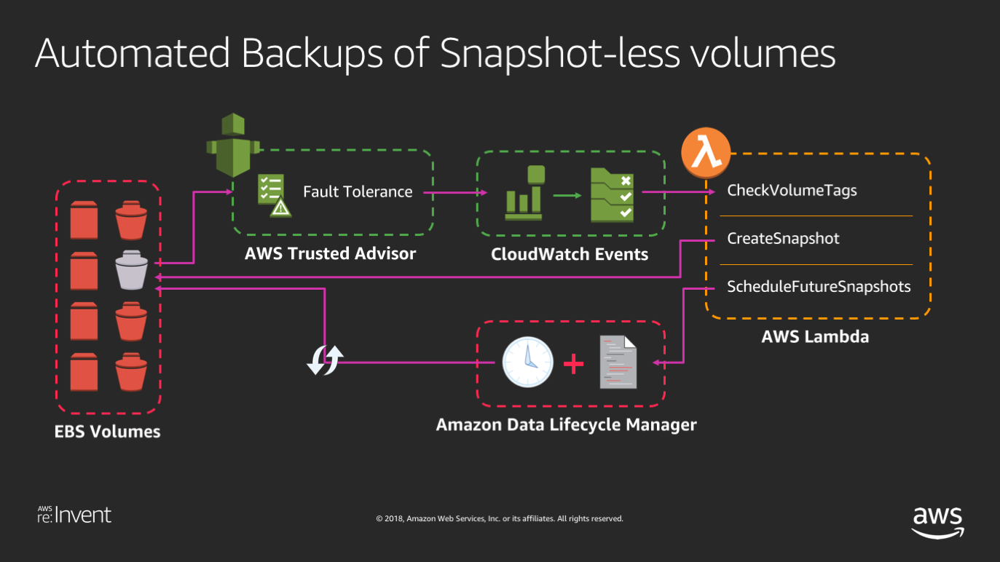
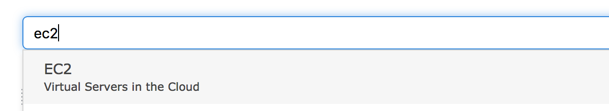
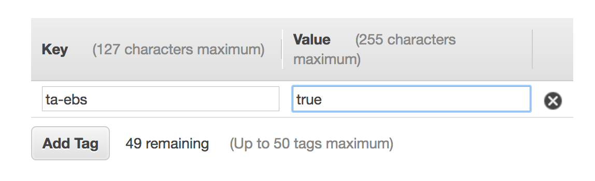
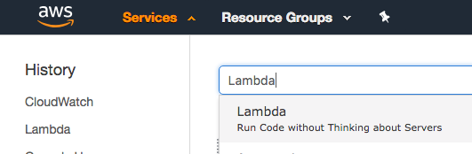
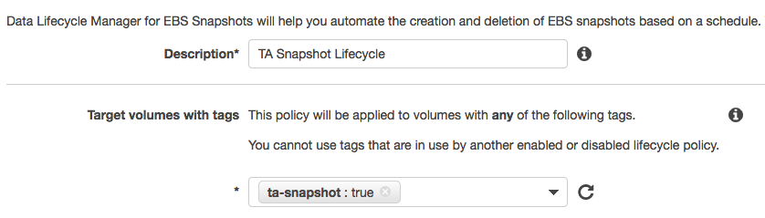
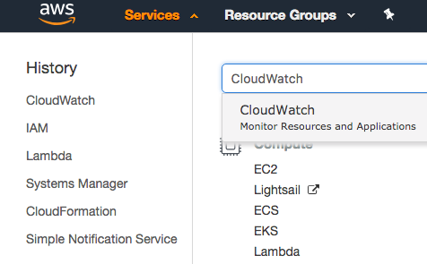

## Trusted Advisor Automated Backups of Snapshot-less volumes

Trusted Advisor checks the age of the snapshots for your Amazon Elastic Block Store (Amazon EBS) volumes (available or in-use). Even though Amazon EBS volumes are replicated, failures can occur. Snapshots are persisted to Amazon Simple Storage Service (Amazon S3) for durable storage and point-in-time recovery. You can automatically create EBS snapshots for volumes that do not have a recent backup as recommended by Trusted Advisor using Amazon Cloudwatch events and AWS Lambda, and by using Lifecycle Management for Amazon EBS Snapshots to ensure snapshots are taken at periodic intervals. 

These steps will go through the how to set up automated backups of such volumes.




### Step 1 Creating an empty EBS volume.
<details>
<summary>**[ Click here for detailed steps ]**</summary><p>

1. From AWS console, click on Services and type in EC2 in the search bar and press enter. 
2. Click on **Volumes** on the left menu under Elastic Block Store.
3. Click on **Create Volume**.
4. Click on **Add Tag**, enter the key/value 'ta-ebs' : 'true' . 
5. You can keep all the other default values.
6. Click on **Create Volume**, write down the newly created volume id.

</p></details>

### Step 2 Creating Lambda Function to create EBS volume snapshot and tag the volume.

<details>
<summary>**[ Click here for detailed steps ]**</summary><p>

1. From AWS console, click on Services and type in Lambda in the search bar and press enter. 
2. Click on **Create Function** 
3. Type in your function name. **Example:** *ta-ebs-snapshot*
4. Set Runtime to **Python3.6**
5. Select Create custom role, on the newly opened page input a **Role Name**. **Example:** *ta-ebs-role* 
6. On the newly opened page, click on **View Policy Document** and then **Edit**
7. Copy and paste below IAM Role and click **Allow**

IAM Role

```
{
    "Version": "2012-10-17",
    "Statement": [
        {
            "Sid": "Stmt1477516473539",
            "Action": [
                "logs:CreateLogGroup",
                "logs:CreateLogStream",
                "logs:PutLogEvents"
            ],
            "Effect": "Allow",
            "Resource": "arn:aws:logs:*:*:*"
        },
        {
            "Sid": "Stmt1477680111144",
            "Action": [
                "ec2:CreateSnapshot",
                "ec2:DescribeTags",
                "ec2:CreateTags"
            ],
            "Effect": "Allow",
            "Resource": "*"
        }
    ]
}
```

8. Click on **Create Function**.
9. Copy Paste below Lambda Function Code and click **Save**.

Lambda Function Code

```
import json
import boto3


def create_snapshot(volume_id, region):
    ec2 = boto3.client('ec2', region_name=region)
    # the function will only consider volumes with the tag 'ta-ebs'
    allowed_tag = 'ta-ebs'
    
    describe_tags_params = [
        {
            'Name' : 'resource-id',
            'Values': [volume_id],
        },
        {
            'Name': 'key',
            'Values': [allowed_tag]
        }
    ]
    
    # we check if the volume has the tag 'ta-ebs'
    print ('Checking tags for volume: %s' % volume_id)
    describe_response = ec2.describe_tags(Filters=describe_tags_params)
    print (describe_response)
    
    if len(describe_response['Tags']) >0:
    
        snapshot_description = 'Automated Snapshot by TA automation for volume %s' % volume_id
        response = ec2.create_snapshot(Description=snapshot_description, VolumeId=volume_id )
        print (response)
        
        # tag the volume with the tag used by Data Lifecycle Manager
        resources=[
            volume_id
        ]
    
        tags = [
            {
                'Key': 'ta-snapshot',
                'Value': 'true'
            }
        ]
    
        response = ec2.create_tags(Resources=resources, Tags=tags)
        print (response)
        
        print ('Snapshot initiated and volume tagged for snapshot lifecycle management')
    else:
        print ('Volume %s in region %s did not match tag, skipping.' % (volume_id, region))
    
def lambda_handler(event, context):
    
    print(json.dumps(event))
    
    check_name = event['detail']['check-name'];
    region = event['detail']["check-item-detail"]["Region"];
    volume_id = event['detail']['check-item-detail']['Volume ID']
    
    ta_success_msg = 'Successfully got details from Trusted Advisor check, %s and executed automated action.' % check_name
    print (ta_success_msg)
    create_snapshot(volume_id, region)
    
    return None
```

10. You can test the lambda function with this payload to see if it triggers the automation document

```
{
  "detail": {
    "check-name": "Amazon EBS Snapshots",
    "check-item-detail": {
      "Volume ID": "<replace with your Volume ID>",
      "Region": "<replace with the Volume's region (e.g. us-east-1)"
    }
  }
}
```


</p></details>

### Step 3 - Create Snapshot Lifecycle Policy.

<details>
<summary>**[ Click here for detailed steps ]**</summary><p>

1. From AWS console, click on Services and type in EC2 in the search bar and press enter. 
2. Click on **Lifecyle Manager** on the left menu under Elastic Block Store.
3. Click on **Create Snapshot Lifecycle Policy**.
4. In the **Description** field enter the value 'TA snapshot lifecycle'.
5. In the **Target volumes with tags** field enter the value 'ta-snapshot : true' 
6. In the **Retention rule** field enter the value '3', this will retain up to three snapshots for the volume.
7. Adjust the other values **Create snapshots every**, 
**Snapshot creation start time**, **Tag created snapshots** as desired.
8. Click on **Create Policy**.

</p></details>


### Step 4 Creating CloudWatch Events to trigger Lambda.
**Note:** The following steps must be deployed in the **us-east-1** region, if you have created the Lambda Function in another region you will have to use the CLI to specify that function as a target.
<details>
<summary>**[ Click here for detailed steps ]**</summary><p>

1. From AWS console, click on Services and type in CloudWatch in the search bar and press enter. 
2. Click on **Rules** under Events on the left side of the menu screen.
3. Click **Create Rule**
4. Click **Edit** on the event source pattern and copy and paste the event pattern below.

```
{
  "source": [
    "aws.trustedadvisor"
  ],
  "detail-type": [
    "Trusted Advisor Check Item Refresh Notification"
  ],
  "detail": {
    "status": [
      "ERROR"
    ],
    "check-name": [
      "Amazon EBS Snapshots"
    ]
  }
}
```

5. Click **Add target** 
6. Select Function you created on step 1.
7. Keep everything else default.
8. Click **Configure Details**.
9. Input a **Name** for the rule. **Example**: *ta-ebs-rule*.
10. Click **Create Rule**.

**Mock Events**

Trusted Advisor might not detect immediately an EBS volume lacking a snapshot. For the purpose of this event you can trigger a mock event by creating this rule below, follow the same step above but change the Event Pattern to this:

```
{
  "source": [
    "awsmock.trustedadvisor"
  ],
  "detail-type": [
    "Trusted Advisor Check Item Refresh Notification"
  ],
  "detail": {
    "status": [
      "ERROR"
    ],
    "check-name": [
      "Amazon EBS Snapshots"
    ]
  }
}
```

To trigger mock event run below command. ( Require AWS CLI )

`aws events put-events --entries file://mockpayload.json`

**mockpayload.json**

```
[
  {
    "DetailType": "Trusted Advisor Check Item Refresh Notification",
    "Source": "awsmock.trustedadvisor",
    "Time": "2018-11-05T14:46:52Z",
    "Resources": [],
    "Detail": "{ \"check-name\": \"Amazon EBS Snapshots\", \"check-item-detail\": { \"Status\": \"Red\", \"Volume Attachment\": \"\", \"Volume ID\": \"<REPLACE VOLUME ID>\", \"Snapshot Name\": null, \"Region\": \"<REPLACE REGION>\", \"Snapshot ID\": null, \"Volume Name\": null, \"Snapshot Age\": null, \"Reason\": \"No snapshot\" }, \"status\": \"ERROR\", \"resource_id\": \"arn:aws:ec2:<REPLACE REGION>:<REPLACE ACCOUNT ID>:volume/<REPLACE VOLUME ID>\", \"uuid\": \"e880a3df-b2ca-47c3-8e10-1b5c445b0620\" }"
 }
]

```
Adjust the time, volume id, region and account.

</p></details>

