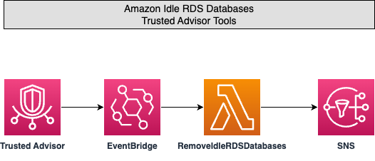

## Amazon RDS Idle DB Instances

### Trusted Advisor Check Description
  Checks the configuration of your Amazon Relational Database Service (Amazon RDS) for any database (DB) instances that appear to be idle.
  If a DB instance has not had a connection for a prolonged period of time, you can delete the instance to reduce costs. A DB instance is considered idle if the instance hasn't had a connection in the past 7 days. If persistent storage is needed for data on the instance, you can use lower-cost options such as taking and retaining a DB snapshot. Manually created DB snapshots are retained until you delete them.


### About the Architecture
 Amazon EventBridge captures the Trusted Advisor Check Item Refresh Notification for Amazon RDS Idle DB Instances. An AWS Lambda function is triggered via Amazon EventBridge to either stop or delete the flagged RDS instance depending on your selection in the CloudFormation template. If you choose to delete the instance, the application will also take a final snapshot. You are also notified via SNS of any RDS databases that are terminated. 

### Parameters
- MINAGE: Trusted Advisor flags databases that have not had a connection in the last 7 days. You can choose a value between 7-14 to only affect databases that haven't been connected to in at least a certain number of days. Example: If you set this value to 10, only databases that haven't had a connection in over 10 days will be terminated.
- SNSTOPICARN: The ARN of the SNS topic to send notifications to. If this is left blank, no SNS notifiation will be sent.
- TERMINATIONMETHOD: Choose to either stop or delete flagged resources. If you choose to delete the databse, a final snapshot will be taken and its identifier will be included in the SNS topic email notification.


### Installation

#### AWS SAM
If you havent already, [install AWS SAM](https://docs.aws.amazon.com/serverless-application-model/latest/developerguide/install-sam-cli.html). Ensure you are in the `AmazonRDSIdleDBInstances` folder then `build` and `deploy` your package

```bash
cd AmazonRDSIdleDBInstances
sam build && sam deploy -g
```


More information about Trusted Advisor is available here: https://aws.amazon.com/premiumsupport/trustedadvisor/

Please note that this is a just an example of how to setup automation with Trusted Advisor, Cloudwatch and Lambda. We recommend testing it and tailoring to your environment before using in your production envirnment.

