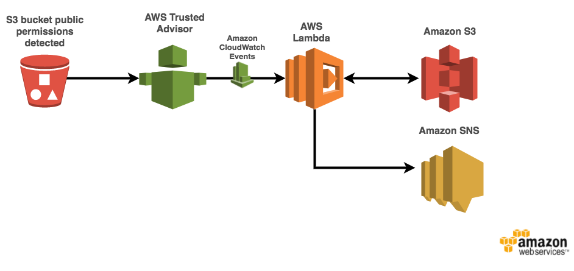

# Trusted Advisor S3 Bucket Permissions Monitor

The Trusted Advisor S3 Bucket Permissions Monitor demonstrates how to use [AWS Lambda](http://aws.amazon.com/lambda/) to perform IT SecOps automation in response to an [Amazon CloudWatch](https://aws.amazon.com/cloudwatch/) Event generated by [AWS Trusted Advisor](https://aws.amazon.com/premiumsupport/trustedadvisor/). 

On detection of a Trusted Advisor S3 Bucket Permissions CloudWatch Event this automation removes the public permissions to list and write objects to the exposed bucket, as well as the permissions to read and write to the bucket's ACLs. Once the public permissions have been removed a notification message is sent to an [Amazon Simple Notification Service](https://aws.amazon.com/sns/) (SNS) topic to notify the subscribers.

This repository contains sample code for all the AWS Lambda functions depicted in the diagram below as well as an AWS CloudFormation template for creating the functions and related resources.



### Walkthrough of the Architecture
1. S3 bucket created with or modified to have public permissions for listing or writing objects or ACLs to the bucket.
1. Trusted Advisor detects the public permissions on the bucket, generating a Trusted Advisor S3 Bucket Permissions CloudWatch Event.
1. A configured CloudWatch Events rule matches this event, triggering an invocation of the `S3PermissionsMonitor` Lambda function, which performs the following actions:
    * Remove the public permissions on the S3 bucket
    * Send security notification message containing summary of offending permissions to `SecurityNotificationTopic` SNS Topic.

## Running the Example
 
#### Option 1: Launch the CloudFormation Template in US East - N. Virginia (us-east-1) 
The backend infrastructure can be deployed in US East - N. Virginia (us-east-1) using the provided CloudFormation template.
Click **Launch Stack** to launch the template in the US East - N. Virginia (us-east-1) region in your account:

[](https://console.aws.amazon.com/cloudformation/home?region=us-east-1#/stacks/new?stackName=S3BucketPermissionsMonitor&templateURL=https://s3.amazonaws.com/trusted-advisor-tools-projects/S3BucketPermissions/s3_monitor_permissions.output.yaml)

(In the last page of the wizard, make sure to:

1. Click the checkboxes to give AWS CloudFormation permission to **"create IAM resources"** and **"create IAM resources with custom names"**
1. Follow the instructions to **"Create Change Set"** 
1. Click **"Execute"**
)

#### Option 2: Launch the CloudFormation Template Manually 

If you would like to deploy the template manually, you need a S3 bucket in the target region, and then package the Lambda functions into that S3 bucket by using the `aws cloudformation package` utility.

** Note that this template may only be launched into US East - N. Virginia (us-east-1) as that is the only region where Trusted Advisor CloudWatch Event rules are configurable. **


Set environment variables for later commands to use:

```bash
S3BUCKET=[REPLACE_WITH_YOUR_BUCKET]
```

Then go to the `cloudformation` folder and use the `aws cloudformation package` utility

```bash
cd cloudformation

aws cloudformation package --region us-east-1 --s3-bucket $S3BUCKET --template s3_monitor_permissions.serverless.yaml --output-template-file s3_monitor_permissions.output.yaml
```
Last, deploy the stack with the resulting yaml (`s3_monitor_permissions.output.yaml`) through the CloudFormation Console or command line:

```bash
aws cloudformation deploy --region us-east-1 --template-file s3_monitor_permissions.output.yaml --stack-name S3PermissionsMonitor --capabilities CAPABILITY_NAMED_IAM
```


## Testing the Example

### Create a Test Bucket
To test the example without exposing a production S3 bucket you can simulate this scenario by creating a test bucket with public permissions. To do this follow the steps detailed below.

1. Navigate to the [S3](https://s3.console.aws.amazon.com/s3/home) console
1. Click `Create bucket` then follow the steps for creating your test bucket
    * For `Name and region` enter a valid bucket name and desired region for the bucket then click `Next`
    * For `Set properties` click `Next`
    * For `Set permissions` click `Next` (we will set permissions later)
    * For `Review` click `Next`
1. Click the bucket name of your newly created test bucket
1. Navigate to the `Permissions` tab
1. In the `Public access` section under the `Group` column click the radio button for `Everyone`
1. In the resulting pane under `Access to Objects` select the `List objects` and `Write objects` radio buttons, then click `Save`

### Trigger Automation Workflow
Trusted Advisor automatically runs checks at regular intervals. Instead of waiting for the next scheduled check cycle we will manually run the check for S3 from the Trusted Advisor console to trigger this workflow using the steps detailed below.

1. Navigate to the [Trusted Advisor](https://console.aws.amazon.com/trustedadvisor/home?region=us-east-1#/dashboard) console
1. In the top right corner of the page click the `Refresh All` button to manually run a check cycle.

**Note: if the button is greyed out then a manual check cycle has already recently run so you must wait a small delay before running another**

You can verify the permissions have been removed via the S3 console. The security notification message will be sent to the e-mail address(es) subscribed to the `SecurityNotificationTopic` SNS Topic.

 Here is an example of what this message might look like for a user who has made recent API calls to IAM and Step Functions:
 ```
At DETECTED_TIME public read and/or write permissions were detected on the S3 bucket BUCKET_NAME of account ACCOUNT_ID, and have subsequently been removed.

Please ensure your AWS account remains secure by logging in and further reviewing the ACLs and recently created objects for the bucket via the S3 console.
 ```

Make sure to clean up from your test by deleting the test bucket after once complete.


## Cleaning Up the Stack Resources

To remove all resources created by this example, do the following:

1. Delete the CloudFormation stack.
1. Delete the CloudWatch log groups associated with each Lambda function created by the CloudFormation stack.

## CloudFormation Template Resources

The following sections explain all of the resources created by the CloudFormation template provided with this example.

### CloudWatch
- **TrustedAdvisorS3BucketPermissionsRule** - A CloudWatch Events Rule to detect Trusted Advisor S3 Bucket Permissions events and send them to Lambda function target

### Lambda
- **S3PermissionsMonitor** - Lambda function that removes public S3 bucket permissions and sends security notification message to SNS Topic created by this CloudFormation template.

### SNS
- **SecurityNotificationTopic** - SNS Topic that API activity security message is sent to.

### IAM
- **LambdaS3PermissionsMonitorRole** - IAM Role with policy that allows Lambda function to invoke the "s3:PutBucketAcl", "s3:GetBucketAcl" and "sns:Publish" API calls and write log messages to CloudWatch Logs.


## License

This reference architecture sample is licensed under Apache 2.0.
