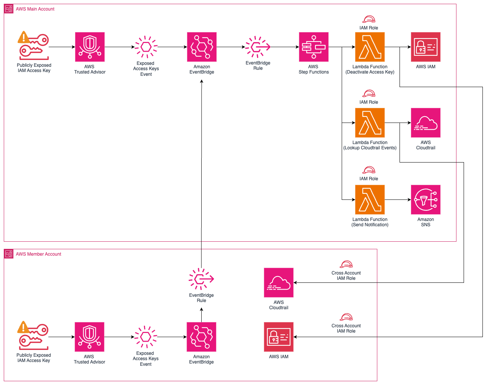

# Trusted Advisor Automation for Exposed Access Keys 

This Terraform configuration sets up an automation system to respond to Trusted Advisor alerts for exposed AWS access keys [Trusted Advisor Check ID: 12Fnkpl8Y5](https://docs.aws.amazon.com/awssupport/latest/user/security-checks.html#exposed-access-keys). It creates the necessary AWS resources to detect and react to these security events.

This can be deployed in Single Account or Multiple Account scenario. 



Terraform code for each scenario is in different directories. 
```
|_main
    |_src
        |_ta-12Fnkpl8Y5-deactivateiamkey.py
        |_ta-12Fnkpl8Y5-cloudtraileventlookup.py
        |_ta-12Fnkpl8Y5-snsmessage.py
    |_main.tf
    |_variables.tf
|_member
    |_main.tf
    |_variables.tf
|_readme.md (this file)
|_mockevent.json (fake event used for testing)
|_mockevent-child.json (fake event used for testing)
```

## Prerequisites

- AWS CLI configured with appropriate permissions
- Terraform v0.12+ installed


## Main Account AWS Resources Created (Mandatory)

- IAM Roles:
  - Lambda execution role
  - Step Functions execution role
  - EventBridge rule role

- Lambda Functions:
  - Deactivate IAM Key
  - CloudTrail Event Lookup
  - SNS Message Sender

- SNS Topic:
  - For sending notifications about exposed keys

- Step Function:
  - Orchestrates the execution of Lambda functions

- EventBridge:
  - Custom event bus
  - Rule to trigger Step Function on Trusted Advisor alerts

### Usage

1. Initialize the Terraform working directory:

terraform init


2. Review the planned changes:

terraform plan

3. Apply the Terraform configuration:

terraform apply

4. When prompted, enter the required variables or provide a `.tfvars` file.

#### Variables

- `email`: Email address for SNS notifications

NOTE: You will have to confirm the subscription by following the link in the email "AWS Notification - Subscription Confirmation"

#### Outputs

- `region`: AWS region where resources will be created (default:eu-west-1)
- `event_bus_arn`: ARN of the created EventBridge bus

#### File Structure

- `main.tf`: Main Terraform configuration file
- `variables.tf`: Variable definitions
- `outputs.tf`: Output definitions
- `src/`: Directory containing Lambda function source code


## Member Account AWS Resources (Optional)

1. IAM Roles:
   - Cross-account IAM role for Lambda function execution
   - IAM role for EventBridge rule execution

2. EventBridge (CloudWatch Events):
   - Rule to detect Trusted Advisor notifications for exposed access keys
   - Target to trigger a response (likely a Step Function, defined elsewhere)

### Usage

1. Initialize the Terraform working directory:

terraform init


2. Review the planned changes:

terraform plan

3. Apply the Terraform configuration:

terraform apply

4. When prompted, enter the required variables or provide a `.tfvars` file.

#### Variables

- `region`: AWS region where resources will be created (default:eu-west-1)
- `event_bus_arn`: ARN of the event bus where events will be sent

#### File Structure

- `main.tf`: Main Terraform configuration file
- `variables.tf`: Variable definitions


## Customization

To customize this configuration:

1. Modify the Lambda function code in the `src/` directory.
2. Adjust the IAM permissions in the role definitions as needed.
3. Update the Step Function definition to change the automation workflow.
4. Modify the EventBridge rule pattern to trigger on different events.

## Security Considerations

- Review and adjust IAM permissions to adhere to the principle of least privilege.
- Ensure that SNS topics and other resources are properly secured.
- Regularly review and update the automation logic to match your security policies.

## Contributing

For any improvements or issues, please open an issue or pull request in the repository.
