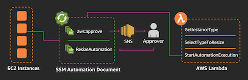

#Trusted Advisor Automation against High Utilization EC2 Instance

Trusted Advisor checks the Amazon Elastic Compute Cloud (Amazon EC2) instances that were running at any time during the last 14 days and alerts you if the daily CPU utilization was more than 90% on 4 or more days. Consistent high utilization can indicate optimized, steady performance, but it can also indicate that an application does not have enough resources. To get daily CPU utilization data, download the report for this check. These steps will go through the how to set up automated EC2 instance resize with approval. 


## Walkthrough

### Step 0 - Preparing the EC2 instance.

In this step, we will be deploying the subject EC2 instance for our automation. This EC2 instance will be the test subject for our EC2 Resize automation.


<details>
<summary>[ Click here for detailed steps ]</summary><p>

1. From AWS console, take note of the region you are launching your resource.
2. Launch a generic EC2 instance with any lowest instance type in the instance family e.g : t2.nano. [Click Here](https://docs.aws.amazon.com/AWSEC2/latest/UserGuide/launching-instance.html "Create EC2 Instance") for step by step guide on how to do so.
3. Other than the EC2 instance type the rest of the instance confguration can be kept default.
4. We will not be logging in to the EC2 instance, so keypair creation is optional.

</p></details>

### Step 1 - Run Resize Automation Document.

In this step, we will be executing an automated EC2 Resize activity using the AWS pre-build `AWS-ResizeInstance` Automated Document. This Automation Document is already available by default in every region where EC2 Systems Manager is available. 


<details>
<summary>**[ Click here for detailed steps ]**</summary><p>

1. From AWS console, click on Services and type in Systems Manager in the search bar and press enter. 
2. Click on **Automation** on the left menu.
3. Click on **Execute automation**.
4. Search for **AWS-ResizeInstance** using the search bar.
5. Select on the document enter an **Instance Id** and the **Instance Type** you would like to change in the parameter, and click on **Execute automation**. 
	

6. Watch the automation progress by clicking on **Automation** and the running with **AWS-ResizeInstance** document name. 
	

7. You can also watch the EC2 instance being resized from the normal EC2 console. 
	

</p></details>


### Step 2 - Building Resize Automation Document with Approval.

In this step we will be creating a custom Systems Manager Automation Document to add an approval request before going ahead and resizing the EC2 instance with `AWS-ResizeInstance` as we have done on previous step.


<details>
<summary>**[ Click here for detailed steps ]**</summary><p>

_**Note :**_
*Please create the SNS Topic below in the same region where you deployed the Automation Document and your instance on step 0. Please also take note of the region name for the remaining of the workshop.*

**SNS Topic**

1. Browse to AWS SNS console, click **Services** and type **SNS** in the search bar then press enter.
2. From here click on **Create Topic**, type in **Topic Name** and **Display Name** and click **Create Topic**
3. Copy and paste the Topic ARN on a notepad ( we will use it later ).
4. Click on **Create subscription**, select Email for protocol and type in your email addess on endpoint.
5. Click **Create subscription**.
6. You should receive an email from SNS to the email address, click on the verify link in the email to confirm subscription and start accepting notification from this topic.

**Automation Document**

1. From AWS console, click on **Services** and type in **Systems Manager** in the search bar and press enter. 
	

2. Click on **Documents** on the left menu.
3. Click on **Create Document**, type in the **Name** `ta-automation-approval-autodocs` and select **Automation document** for the **document type**.
4. Paste below into the content secton.
5. Replace the `<enter your SNS topic ARN here>` with the SNS topic ARN you took on step 3 above.
6. Replace the `<enter the approver IAM user ARN>` with the ARN of your current IAM user.
7. Click **create document**

```
{
  "description": "Resize Instance with Approval",
  "assumeRole": "{{ AutomationAssumeRole }}",
  "schemaVersion": "0.3",
  "parameters": {
    "AutomationAssumeRole": {
      "default": "", 
      "description": "(Optional) The ARN of the role that allows Automation to perform the actions on your behalf.",
      "type": "String"
    },
    "InstanceId": {
      "description": "(Required) EC2 Instance to restart",
      "type": "String"
    },
    "InstanceType": {
      "description": "(Required) EC2 Instance Type",
      "type": "String"
    }
  },
  "mainSteps": [
    {
      "inputs": {
        "Message": "You have an Instance Resize approval request.",
        "NotificationArn": "<enter your SNS topic ARN here>",
        "MinRequiredApprovals": 1,
        "Approvers": [
          "<enter the approver IAM user ARN>"
        ]
      },
      "name": "Approve",
      "action": "aws:approve",
      "onFailure": "Abort"
    },
    {
      "maxAttempts": 10,
      "inputs": {
        "RuntimeParameters": {
          "InstanceId": "{{ InstanceId }}",
          "InstanceType": "{{ InstanceType }}"
        },
        "DocumentName": "AWS-ResizeInstance"
      },
      "name": "Resize",
      "action": "aws:executeAutomation",
      "timeoutSeconds": 600,
      "onFailure": "Abort"
    }
  ]
}
```

**Execute automation document (Optional)** 

1. From AWS console, click on Services and type in Systems Manager in the search bar and press enter. 
	

2. Click on **Automation** on the left menu.
3. Search for `ta-automation-approval-autodocs` and click.
4. Click on **Execute automation**.
5. Search for the name of the Automation Document created above using the search bar.
6. Select on the document enter an **Instance Id** and the **Instance Type** you would like to change in the parameter, and click on **Execute automation**. 
	

7. Watch the automation progress by clicking on **Automation** and the running with `ta-automation-approval-autodocs` document name. 
	

8. Wait for an email from SNS notification asking for your approval, click on the approve url and select approve, and proceed with approving the request.
7. Watch EC2 instance being resized from the normal EC2 console. 
	

</p></details>

### Step 3 Creating Lambda Function to trigger Automation Document.

In this step we will be creating a Lambda Function that will be the decission maker for which EC2 instance type the automation will resize to. There are many possibilities on how the decission can be made, however for the purpose of this workshop, the automation will increase the instance type to the next higher type in the same family e.g: t2.nano to t2.small to t2.medium and so on. Once the lambda decides which EC2 instance to resize to, it will then execute the Automation Document created in previous steps.

_**Note :**_

*The following steps must be deployed in us-east-1 region. This is because Trusted Advisor endpoint is only available in us-east-1 therefore events can only be captured in the region. Having said that, Trusted Advisor will still check and emits event for all resources in AWS Account accross all region.*



<details>
<summary>**[ Click here for detailed steps ]**</summary><p>

1. From AWS console, click on Services and type in Lambda in the search bar and press enter. 
	

2. Click on **Create Function** 
3. Type in your function **Name**.
4. Set Runtime to **Python3.6**
5. Select Create custom role, click on **Edit**.
6. Choose Create a new IAM Role, and type in the role name.
7. Copy and paste below IAM Role and click **Allow**

	```
	{
	    "Version": "2012-10-17",
	    "Statement": [
	        {
	            "Effect": "Allow",
	            "Action": [
	                "logs:CreateLogStream",
	                "logs:CreateLogGroup",
	                "logs:PutLogEvents"
	            ],
	            "Resource": [
	                "arn:aws:logs:*:*:*"
	            ]
	        },
	        {
	            "Effect": "Allow",
	            "Action": [
	                "sns:Publish"
	            ],
	            "Resource": [
	                "*"
	            ]
	        },
	        {
	            "Effect": "Allow",
	            "Action": [
	                "iam:PassRole",
	                "iam:CreateRole",
	                "iam:DeleteRolePolicy",
	                "iam:PutRolePolicy",
	                "iam:GetRole",
	                "iam:DeleteRole"
	            ],
	            "Resource": [
	                "*"
	            ]
	        },
	        {
	            "Effect": "Allow",
	            "Action": [
	                "ssm:StartAutomationExecution",
	                "ssm:StopAutomationExecution",
	                "ssm:GetAutomationExecution"
	            ],
	            "Resource": [
	                "*"
	            ]
	        },
	        {
	            "Effect": "Allow",
	            "Action": [
	                "ec2:DescribeInstances",
	                "ec2:DescribeInstanceStatus",
	                "ec2:StartInstances",
	                "ec2:ModifyInstanceAttribute",
	                "ec2:StopInstances"
	            ],
	            "Resource": "*"
	        },
	        {
	            "Effect": "Allow",
	            "Action": [
	                "lambda:CreateFunction",
	                "lambda:InvokeFunction",
	                "lambda:AddPermission",
	                "lambda:DeleteFunction",
	                "lambda:GetFunction"
	            ],
	            "Resource": "*"
	        },
	        {
	            "Effect": "Allow",
	            "Action": [
	                "cloudformation:CreateStack",
	                "cloudformation:DeleteStack",
	                "cloudformation:DescribeStacks"
	            ],
	            "Resource": "*"
	        }
	    ]
	}
	```

7. Copy Paste below Lambda Function Code and click **Save**
	
	
	```
	import json
	import boto3
	import os
	
	## EC2 Instance Table to decide which instance type to resize
	i_list = {
	  "t2":["nano","micro","small","medium","large","xlarge","2xlarge"],
	  "t3":["nano","micro","small","medium","large","xlarge","2xlarge"],
	  "m5d":["large","xlarge","2xlarge","4xlarge","12xlarge","24xlarge"],
	  "m5":["large","xlarge","2xlarge","4xlarge","12xlarge","24xlarge"],
	  "m4":["large","xlarge","2xlarge","4xlarge","10xlarge","16xlarge"],
	  "c5d":["large","xlarge","2xlarge","4xlarge","9xlarge","18xlarge"],
	  "c5":["large","xlarge","2xlarge","4xlarge","9xlarge","18xlarge"],
	  "c4":["large","xlarge","2xlarge","4xlarge","8xlarge"],
	  "f1":["2xlarge","16xlarge"],
	  "g3":["4xlarge","8xlarge","16xlarge"],
	  "g2":["2xlarge","8xlarge"],
	  "p2":["xlarge","8xlarge","16xlarge"],
	  "p3":["2xlarge","8xlarge","16xlarge"],
	  "r5d":["large","xlarge","2xlarge","4xlarge","12xlarge","24xlarge"],
	  "r5":["large","xlarge","2xlarge","4xlarge","12xlarge","24xlarge"],
	  "r4":["large","xlarge","2xlarge","4xlarge","8xlarge","16xlarge"],
	  "x1":["16xlarge","32xlarge"],
	  "x1e":["xlarge","2xlarge","4xlarge","8xlarge","16xlarge","32xlarge"],
	  "z1d":["large","xlarge","2xlarge","3xlarge","6xlarge","12xlarge"],
	  "d2":["xlarge","2xlarge","4xlarge","8xlarge"],
	  "i2":["xlarge","2xlarge","4xlarge","8xlarge"],
	  "h1":["2xlarge","4xlarge","8xlarge","16xlarge"],
	  "i3":["large","xlarge","2xlarge","4xlarge","8xlarge","16xlarge"]
	}
	
	## Function to decide new EC2 instance type
	## This function will choose a higher instance type in the same family 
	def getResize(IType):
	    I = IType.split(".")
	    Idx = i_list[I[0]].index(I[1])
	    leng = len(i_list[I[0]]) - 1
	    
	    if Idx < leng:
	        NIdx = Idx + 1
	        RType = I[0] + "." + i_list[I[0]][NIdx]
	    else:
	        RType = "none"
	    return(RType)
	
	## Function to find instance type from instance id.
	def getIType(IID,ec2):
	    resp = ec2.describe_instances(InstanceIds=[IID])
	    RType = resp['Reservations'][0]['Instances'][0]['InstanceType']
	    return(RType)
	
	## Lambda Handler Function
	def lambda_handler(event, context):
	    print(json.dumps(event))
	    RARN = event['detail']['resource_id'].split(':')
	    REGION = RARN[3]
	    
	    ssm = boto3.client('ssm', region_name=REGION)
	    ec2 = boto3.client('ec2', region_name=REGION)
	   
		 # Find Instance ID, check the type and decise which is the next instance type.
	    IID = event['detail']['check-item-detail']['Instance ID']
	    IType = getIType(IID,ec2)
	    RType = getResize(IType)
	    
	    # Execute Automation Document of ResizeAutoDocument Environment variable.
	    # xecute Automation Document
	    if RType != "none":
	        x = ssm.start_automation_execution(
	                DocumentName = os.environ['ResizeAutoDocument'],
	                Parameters= { 
	                    'InstanceId': [IID], 
	                    'InstanceType': [RType]
	                  }
	              )
	        print(json.dumps(x))
	        print("Executing Resize")
	    else:
	        print("No Higher Instance Found, Please Review other Instance Family")
	    return(event)
	```

8. Create environment variables with key **ResizeAutoDocument** and the name of the automation document you created on step 2 
	

9. Set the function timeout to 30 seconds or more.
10. **Save** the Lambda Function


**Testing your Automation using Lambda Function Test event** 

10. To test your automation you can ceate a Test event in Lambda function and paste below payload.
11. Copy and paste below content and replace `< instance id >` with instance id in step 0 
12. Replace `< instance region >` with the region where the instance id is deployed in step 0

	```
	{
	  "detail": {
	    "check-item-detail": {
	      "Instance ID": "<instance id>"
	    },
		"resource_id":"arn:aws:ec2:<instance region>:23214342432:instance/<instance id>"
	  }
	}
	```

13. Save the Test event.
14. Click Test.
15. This should now trigger the AutomationDocument execution.
16. Go to Systems Manager Console 
	

17. Click on **Automation** on the left menu.
18. You should be able to see the Automation execution progress ( Look for the one with waiting status ).
19. Wait for an email from SNS notification asking for your approval, click on the approve url and select approve, and proceed with approving the request.
20. Watch EC2 instance being resized from the normal EC2 console. 
	


For visibility here is an example of the event being triggered by TA High Utilization Check.
	
	```
	{  
	   "version":"0",
	   "id":"4d04a964-88a6-7093-74c8-9af26598ca3e",
	   "detail-type":"Trusted Advisor Check Item Refresh Notification",
	   "source":"aws.trustedadvisor",
	   "account":"000000000000",
	   "time":"2018-11-20T01:01:49Z",
	   "region":"us-east-1",
	   "resources":[  
	
	   ],
	   "detail":{  
	      "check-name":"High Utilization Amazon EC2 Instances",
	      "check-item-detail":{  
	         "Day 1":"98.8%",
	         "Day 2":"98.8%",
	         "Day 3":"98.8%",
	         "Region/AZ":"us-west-2c",
	         "14-Day Average CPU Utilization":"98.8%",
	         "Day 14":"98.8%",
	         "Day 13":"98.8%",
	         "Day 12":"98.8%",
	         "Day 11":"98.8%",
	         "Day 10":"98.8%",
	         "Instance Type":"m3.medium",
	         "Instance ID":"i-b6218518",
	         "Day 8":"98.8%",
	         "Instance Name":"Overutilized4",
	         "Day 9":"98.8%",
	         "Number of Days over 90% CPU Utilization":"14",
	         "Day 4":"98.8%",
	         "Day 5":"98.8%",
	         "Day 6":"98.8%",
	         "Day 7":"98.8%"
	      },
	      "status":"WARN",
	      "resource_id":"arn:aws:ec2:us-west-2:753667216438:instance/i-b6218518",
	      "uuid":"e03b12af-004c-412b-9a76-c7d77a907c6d"
	   }
	}
	
	```
</p></details>

### Step 4 Creating CloudWatch Events to trigger Lambda.

In this step we will be creating the CloudWatch Events rule that will capture events from Trusted Advisor for `High Utilization Amazon EC2 Instances` checks and it will subsequently trigger the Lambda function we have created in previous step to kick off the automation.

_**Note :**_

*The following steps must be deployed in us-east-1 region. This is because Trusted Advisor endpoint is only available in us-east-1 therefore events can only be captured in the region. Having said that, Trusted Advisor will still check and emits event for all resources in AWS Account accross all region.*


<details>
<summary>[ Click here for detailed steps ]</summary><p>

1. From AWS console, click on Services and type in CloudWatch in the search bar and press enter. 
	

2. Click on **Rules** under Events on the left side of the menu screen.
3. Click **CreateRule**
4. Click **Edit** on the event source pattern and paste below.

	```
	{
	  "detail-type": [
	    "Trusted Advisor Check Item Refresh Notification"
	  ],
	  "source": [
	    "aws.trustedadvisor"
	  ],
	  "detail": {
	    "check-name": [
	      "High Utilization Amazon EC2 Instances"
	    ],
	    "status": [
	      "WARN"
	    ]
	  }
	}
	```

5. Click **Add target** 
6. Select Function you created on step 3.
7. Keep everything else default.
8. Click **Configure Details** 


**Testing Automation using Trusted Advisor Mock Event (Optional)** 

Trusted Advisor won't trigger the event until a real EC2 instance has been detected on high util over 14 days, therefore for the purpose of testing end to end solution of this automation you can you can trigger cloudwatch custom event 

To do that you will need to create another CloudWatch events rule with below pattern. Note that the only difference between this rule and the one configured previously is the source. 

For security and integrity purposes, access to put custom event as `aws.trustedadvisor` source is not allowed, therefore in below rule we are using `awsmock.trustedadvisor` instead.

1. From AWS console, click on Services and type in CloudWatch in the search bar and press enter. 
	

2. Click on **Rules** under Events on the left side of the menu screen.
3. Click **CreateRule**
4. Click **Edit** on the event source pattern and paste below.


	```
	{
	  "detail-type": [
	    "Trusted Advisor Check Item Refresh Notification"
	  ],
	  "source": [
	    "awsmock.trustedadvisor"
	  ],
	  "detail": {
	    "check-name": [
	      "High Utilization Amazon EC2 Instances"
	    ],
	    "status": [
	      "WARN"
	    ]
	  }
	}
	```

5. Click **Add target** 
6. Select Function you created on step 3.
7. Keep everything else default.
8. Click **Configure Details** 
9. Create a text file and name it **mockpayload.json**
10. Copy and paste below content and replace `< instance id >` with instance id in step 0 
11. Replace `< instance region >` with the region where the instance id is deployed in step 0

	```
	[
	  {
	    "DetailType": "Trusted Advisor Check Item Refresh Notification",
	    "Source": "awsmock.trustedadvisor",
	    "Time": "2017-02-07T00:55:52Z",
	    "Resources": [],
	    "Detail": "{\"check-name\":\"High Utilization Amazon EC2 Instances\",\"check-item-detail\":{\"Instance ID\":\"< instance id >\"},\"status\":\"WARN\",\"resource_id\":\"arn:aws:ec2:< instance region >:23232324324:instance/< instance id >\"}"
	  }
	]
	
	```
*This custom event payload will represent the Trusted Advisor event for this scenario.*

Once you've configured the above rule, and created the **mockpayload.json** file you can trigger the automation by putting a a custom CloudWatch event with below command.
This step will require you to have AWS CLI installed in your laptop. 
Click Here for instructions on how to install and configure AWS CLI, if you do not have them installed.

`aws events put-events --entries file://mockpayload.json`

</p></details>


## CloudFormation Template (Optional)

In this section, we will show you how to deploy the entire resources for this solution (Step 1 to 4) automatically using AWS CloudFormation.

**Note:**

* For the best learning outcome in this workshop, please try to follow the Walkthrough above. And only deploy this CloudFormation template as a last resort in case you are not able to follow / complete the Workshop in time.

* The following cloudformation stack needs to be deployed on us-east-1 only and it is meant to showcase the automation working ec2 resources in us-east-1 only. 

* If your EC2 instance is in other region than us-east-1 you can create individual Approval AutomationDocument in each region with identical name, e.g: `Custom-TA-Resize-Approval` ( Follow Step 2 in walkthrough ). 

* Then specify the name of the AutomationDocument e.g: `Custom-TA-Resize-Approval` in **ResizeAutomationApprovalDocument** parameter when launching the stack below 

<details>
<summary>[ Click here for detailed steps ]</summary><p>

1. Deploy CloudFormation stack using template `ta-automation-highutil-ec2.yml` in us-east-1 region. 
2. Refer here for instructions on how to deploy Stack [Create Stack](https://docs.aws.amazon.com/AWSCloudFormation/latest/UserGuide/cfn-console-create-stack.html "Create Stack").
3. If you are automating instance outside **us-east-1** read the note above and fill in the AutomationDocument name you created in **ResizeAutomationApprovalDocument** parameter. If you leave them blank the automation will only works on **us-east-1**

</p></details>
