# Trusted Advisor Automation against High Utilization EC2 Instance

Trusted Advisor checks the Amazon Elastic Compute Cloud (Amazon EC2) instances that were running at any time during the last 14 days and alerts you if the daily CPU utilization was more than 90% on 4 or more days. Consistent high utilization can indicate optimized, steady performance, but it can also indicate that an application does not have enough resources. To get daily CPU utilization data, download the report for this check. These steps will go through the how to set up automated EC2 instance resize with approval. 

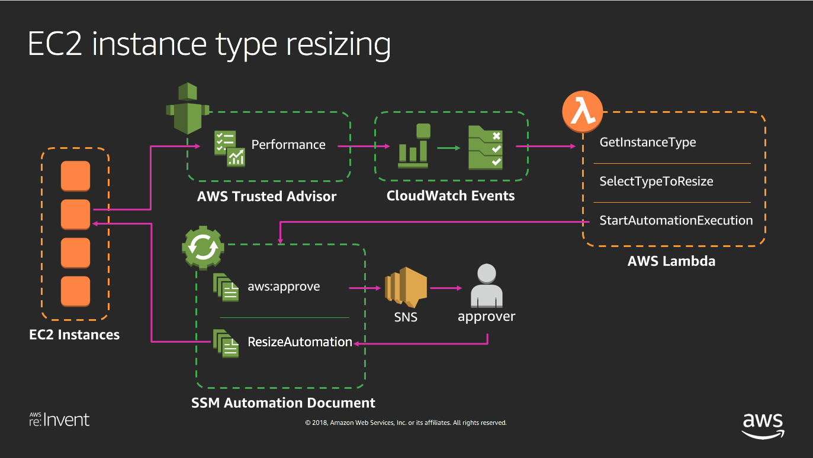


## Walkthrough

### Step 0 - Preparing the EC2 instance.

In this step, we will be deploying a subject EC2 instance for our automation. This EC2 instance will be the test subject that trusted advisor will hypothetically mark as being highly utilized.

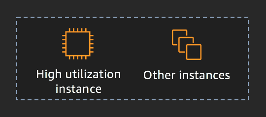

<details>
<summary>[ Click here for detailed steps ]</summary><p>

1. From AWS console, take **note of the region you are launching your resource.**
2. Click on **Launch Instance**.
3. Click **Select** on any AMI ( for the purpose of this workshop whichever AMI you select does not matter, as long as the instance can successfully start ).
4. Select `t2.nano` EC2 instance ( Let's be frugal ) then click **Review and Launch**.
5. Click on **Edit Tags**.
6. Click **Add Tag** and place `Name` under Key and type in `ta-test-instance` as the Value.
5. Click **Review and Launch** once again.
6. Click **Launch**. 
7. Select `Proceed without a key pair` and tick the "I acknowledge that I will not be able to connect to this instance unless I already know the password built into this AMI." 
8. Click **Launch Instances** 

More details on how to launch EC2 instance [Click Here](https://docs.aws.amazon.com/AWSEC2/latest/UserGuide/launching-instance.html "Create EC2 Instance")

</p></details>

### Step 1 - Run Resize Automation Document.

In this step, we will be executing an automated EC2 Resize activity using an AWS pre-built Automated Document named `AWS-ResizeInstance`. This Automation Document is already available by default in every region where EC2 Systems Manager is available, and we will leverage the existing document to automatically change the EC2 instance type. 

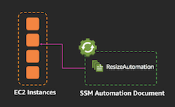

<details>
<summary>[ Click here for detailed steps ]</summary><p>

1. From AWS console make sure to select the same region as the launched EC2 instance in step 0.
2. Then Click on **Services** and type in `Systems Manager` in the search bar, then click on the result.
	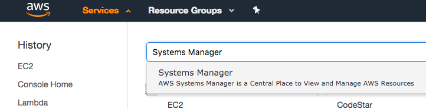

3. Click on **Automation** on the left menu.
3. Click on **Execute automation**.
4. Search for `AWS-ResizeInstance`using the search bar.
5. Select `AWS-ResizeInstance` then click **Next**
6. Under Input parameters enter the Instance Id of the launched EC2 instance in step 0 on `Instance Id` field e.g: i-2daaf3fafads3
7. Enter the Instance type that you would like this instance to resize to under `Instance type` field e.g: `t2.micro`
8. Click on **Execute automation**. 
	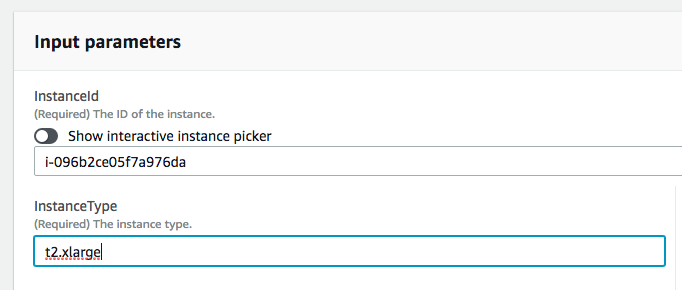
	
9. Watch the automation progressing and notice all the steps Systems Manager has taken for you.
	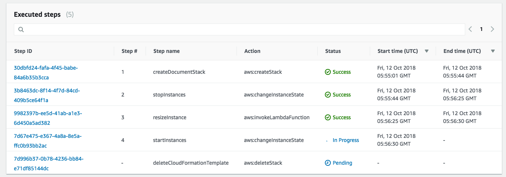

7. Then watch the EC2 instance being stopped, resized, then start again, without human intervention.
	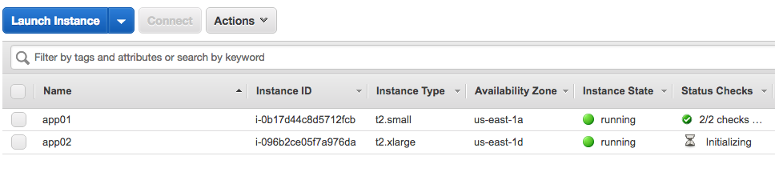

</p></details>


### Step 2 - Building Resize Automation Document with Approval.

So far we have managed to automatically resize an EC2 instance automatically. But executing the resize immediately upon trigger is not ideal, as this process involves stopping the EC2 instance. Therefore, in this scenario we want to give control to our owner to approve / reject the process before executing the resize .

In this step we will be creating a custom Systems Manager Automation Document create a gated process where an approval request is sent to the owner before going ahead and executing the EC2 resize with `AWS-ResizeInstance` as shown in step 1.

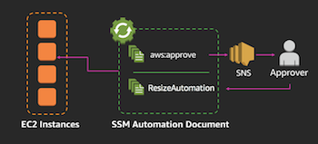

<details>
<summary>[ Click here for detailed steps ]</summary><p>

_**Note :**_
*In this step we will be creating an SNS topic to allow Automation Document to send the approval request. Please ensure to create the SNS Topic below in the same region where you deployed the Automation Document and your instance on step 0. Please also take note of the region name for the remaining of the workshop.*

**Setting up the SNS Topic**

1. From AWS console make sure to select the same region as the launched EC2 instance in step 0.
2. Click **Services** and type `SNS` then click on the result.
3. From here click on Topics, then **Create topic**.
4. Type in `ta-resize-approval-topic` as Topic Name and `taresize` as Display Name.
5. Click **Create Topic** ( Note the SNS topic ARN, we will need this later ) e.g: arn:aws:sns:ap-southeast-2:0227823432442:ta-resize-approval-topic
6. Click on Subscriptions, then **Create subscription**, select Email for protocol and type in your email address as the endpoint.
5. Click **Create subscription**.
6. You should receive an email from SNS service to the email address specified.
7. Click on the **Confirm Subscription** in the email body.
8. From this point onwards any notification that is published to this topic, you will receive the notification in your email.

**Creating the Custom Automation Document**

1. From AWS console make sure to select the same region as the launched EC2 instance in step 0.
2. Then Click on **Services** and type in `Systems Manager` in the search bar, then click on the result.
	
3. Click on **Documents** on the left menu.
4. Click on **Create automation**.
5. Type `Custom-ResizeInstanceApproval` in the Name field.
6. Click on **Editor** to open the document editor.
7. Click **Edit** and select **OK** to edit the document.
8. Copy and paste the YAML below into the Content field, replacing all existing text.
9. Replace the `<enter your SNS topic ARN here>` in the YAML with the SNS topic ARN you took above.
10. Replace the `<enter the approver IAM user ARN>` in the YAML with the ARN of your current IAM user.

	To obtain the current user IAM please follow these steps:
	
	*  From the AWS Console, click on **Services** and type in `IAM` in the search bar, then click on the result.
	*  Click on **Users** on the left menu.
	*  Locate your username and click on **your username**.
	*  Note the User ARN in the User ARN field under Summary section.

11. Click **Create document**

**Custom-ResizeInstanceApproval sample.**

```
description: Resize Instance with Approval
assumeRole: "{{ AutomationAssumeRole }}"
schemaVersion: '0.3'
parameters:
  AutomationAssumeRole:
    default: ''
    description: "(Optional) The ARN of the role that allows Automation to perform
      the actions on your behalf."
    type: String
  InstanceId:
    description: "(Required) EC2 Instance to restart"
    type: String
  InstanceType:
    description: "(Required) EC2 Instance Type"
    type: String
mainSteps:
- inputs:
    Message: You have an Instance Resize approval request.
    NotificationArn: <enter your SNS topic ARN here>
    MinRequiredApprovals: 1
    Approvers:
    - <enter the approver IAM user ARN>
  name: Approve
  action: aws:approve
  onFailure: Abort
- maxAttempts: 10
  inputs:
    RuntimeParameters:
      InstanceId: "{{ InstanceId }}"
      InstanceType: "{{ InstanceType }}"
    DocumentName: AWS-ResizeInstance
  name: Resize
  action: aws:executeAutomation
  timeoutSeconds: 600
  onFailure: Abort
```

**Execute the Custom Automation Document** 

1. From AWS console make sure to select the same region as the launched EC2 instance in step 0.
2. From AWS console, click on Services and type in Systems Manager in the search bar and press enter. 
	

4. Click on **Automation** on the left menu.
5. Click on **Execute automation**.
6. In the search bar, search for the name of the Automation Document you created in this step `Custom-ResizeInstanceApproval`
7. Select on the document then click **Next** 
8. Under Input parameters enter the Instance Id of the launched EC2 instance in step 0 on `Instance Id` field e.g: i-2daaf3fafads3
9. Enter the Instance type that you would like this instance to resize to under `Instance type` field e.g: `t2.xlarge`
10. Click on **Execute**. 
	

11. Notice the number of steps in this document.
12. Once the first step status is "waiting", you should receive an email from SNS notification asking for owner approval. 
13. Click on the **approve URL** on the body of the email.
14. Select `Approve`, and click **Submit**
	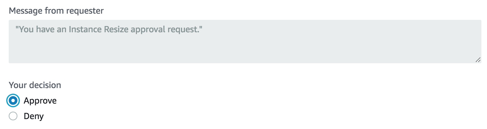

15. Watch EC2 instance being resized from the normal EC2 console. 
	
</p></details>

### Step 3 Creating Instance type decider process and Amazon EventBridge (formerly CloudWatch Events) Rule.

So far, we have created a gated process that will notify an owner for their approval before executing the EC2 resize. But we do not want to stop there, we would also like to automate the decision making process on deciding which EC2 instance to resize to. There are multiple ways this can be done, depending on requirement and how much data is available for the decision making. But in our scenario, we are going to take the simple approach of resizing the EC2 instance to the next level instance type within the same family. e.g: t2.micro to t2.small to t2.medium and so on. 

In this step we will be creating a Lambda Function that will be the decision maker for which EC2 instance type the automation will resize to. Our lambda function will check the instance type of the existing EC2 instance and increase the type to the next higher level in the same family. Once the lambda decides which EC2 instance to resize to, it will then execute the Automation Document created in previous steps.

We will also create an Amazon EventBridge (formerly called CloudWatch Events) rule that will capture Trusted Advisor events of "High Utilization Amazon EC2 Instances: and set it up to trigger our entire automation.

_**Important :**_

*The following steps must be deployed in us-east-1 region. This is because Trusted Advisor endpoint is only available in us-east-1 therefore events can only be captured in the region. Having said that, Trusted Advisor will still check and emits event for all resources in AWS Account across all regions.*

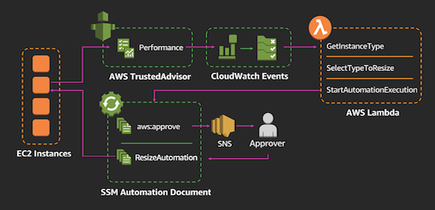

<details>
<summary>[ Click here for detailed steps ]</summary><p>

1. From AWS console make sure to select the us-east-1 region.
2. Click on Services and type in IAM to navigate to the IAM Management Console.
3. To create a custom role for the Lambda function, click on Roles, then Create role.
4. Select Lambda as the service that will be using this Role.
5. Click Create Policy to define a custom policy.
6. Select the JSON tab and paste the policy below:
        ```
	{
	    "Version": "2012-10-17",
	    "Statement": [
	        {
	            "Effect": "Allow",
	            "Action": [
	                "logs:CreateLogStream",
	                "logs:CreateLogGroup",
	                "logs:PutLogEvents"
	            ],
	            "Resource": [
	                "arn:aws:logs:*:*:*"
	            ]
	        },
	        {
	            "Effect": "Allow",
	            "Action": [
	                "sns:Publish"
	            ],
	            "Resource": [
	                "*"
	            ]
	        },
	        {
	            "Effect": "Allow",
	            "Action": [
	                "iam:PassRole",
	                "iam:CreateRole",
	                "iam:DeleteRolePolicy",
	                "iam:PutRolePolicy",
	                "iam:GetRole",
	                "iam:DeleteRole"
	            ],
	            "Resource": [
	                "*"
	            ]
	        },
	        {
	            "Effect": "Allow",
	            "Action": [
	                "ssm:StartAutomationExecution",
	                "ssm:StopAutomationExecution",
	                "ssm:GetAutomationExecution"
	            ],
	            "Resource": [
	                "*"
	            ]
	        },
	        {
	            "Effect": "Allow",
	            "Action": [
	                "ec2:DescribeInstances",
	                "ec2:DescribeInstanceStatus",
	                "ec2:StartInstances",
	                "ec2:ModifyInstanceAttribute",
	                "ec2:StopInstances"
	            ],
	            "Resource": "*"
	        },
	        {
	            "Effect": "Allow",
	            "Action": [
	                "lambda:CreateFunction",
	                "lambda:InvokeFunction",
	                "lambda:AddPermission",
	                "lambda:DeleteFunction",
	                "lambda:GetFunction"
	            ],
	            "Resource": "*"
	        },
	        {
	            "Effect": "Allow",
	            "Action": [
	                "cloudformation:CreateStack",
	                "cloudformation:DeleteStack",
	                "cloudformation:DescribeStacks"
	            ],
	            "Resource": "*"
	        }
	    ]
	}
        ```
7. Click Review policy
8. Enter a name: "ta-resize-lambda-policy" and click Create policy.
9. Go back to the original IAM tab, click the refresh button and search for ta-resize-lambda-policy.
10. Select this policy and click Next: Tags.
11. Tag the policy as needed, then click Next:Review.
12. Enter a Role name "ta-resize-lambda-role" and then click Create role.
13. From the AWS Management console, click on Services and type in Lambda in the search bar and press enter. 
	
14. Click on **Create Function** 
15. Type in your function **Name** as `ta-resize-lambda`.
16. Set Runtime to **Python3.6**
17. Select Use an existing role and select the role created in step 12 and click Create Function.
18. Copy Paste below Lambda Function Code.
	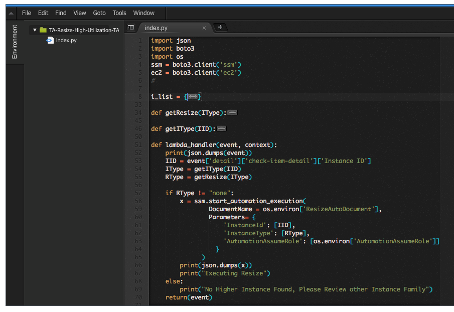
	
	```
	import json
	import boto3
	import os
	
	## EC2 Instance Table to decide which instance type to resize
	i_list = {
	  "t2":["nano","micro","small","medium","large","xlarge","2xlarge"],
	  "t3":["nano","micro","small","medium","large","xlarge","2xlarge"],
	  "m5d":["large","xlarge","2xlarge","4xlarge","12xlarge","24xlarge"],
	  "m5":["large","xlarge","2xlarge","4xlarge","12xlarge","24xlarge"],
	  "m4":["large","xlarge","2xlarge","4xlarge","10xlarge","16xlarge"],
	  "c5d":["large","xlarge","2xlarge","4xlarge","9xlarge","18xlarge"],
	  "c5":["large","xlarge","2xlarge","4xlarge","9xlarge","18xlarge"],
	  "c4":["large","xlarge","2xlarge","4xlarge","8xlarge"],
	  "f1":["2xlarge","16xlarge"],
	  "g3":["4xlarge","8xlarge","16xlarge"],
	  "g2":["2xlarge","8xlarge"],
	  "p2":["xlarge","8xlarge","16xlarge"],
	  "p3":["2xlarge","8xlarge","16xlarge"],
	  "r5d":["large","xlarge","2xlarge","4xlarge","12xlarge","24xlarge"],
	  "r5":["large","xlarge","2xlarge","4xlarge","12xlarge","24xlarge"],
	  "r4":["large","xlarge","2xlarge","4xlarge","8xlarge","16xlarge"],
	  "x1":["16xlarge","32xlarge"],
	  "x1e":["xlarge","2xlarge","4xlarge","8xlarge","16xlarge","32xlarge"],
	  "z1d":["large","xlarge","2xlarge","3xlarge","6xlarge","12xlarge"],
	  "d2":["xlarge","2xlarge","4xlarge","8xlarge"],
	  "i2":["xlarge","2xlarge","4xlarge","8xlarge"],
	  "h1":["2xlarge","4xlarge","8xlarge","16xlarge"],
	  "i3":["large","xlarge","2xlarge","4xlarge","8xlarge","16xlarge"]
	}
	
	## Function to decide new EC2 instance type
	## This function will choose a higher instance type in the same family 
	def getResize(IType):
	    I = IType.split(".")
	    Idx = i_list[I[0]].index(I[1])
	    leng = len(i_list[I[0]]) - 1
	    
	    if Idx < leng:
	        NIdx = Idx + 1
	        RType = I[0] + "." + i_list[I[0]][NIdx]
	    else:
	        RType = "none"
	    return(RType)
	
	## Function to find instance type from instance id.
	def getIType(IID,ec2):
	    resp = ec2.describe_instances(InstanceIds=[IID])
	    RType = resp['Reservations'][0]['Instances'][0]['InstanceType']
	    return(RType)
	
	## Lambda Handler Function
	def lambda_handler(event, context):
	    print(json.dumps(event))
	    RARN = event['detail']['resource_id'].split(':')
	    REGION = RARN[3]
	    
	    ssm = boto3.client('ssm', region_name=REGION)
	    ec2 = boto3.client('ec2', region_name=REGION)
	   
		 # Find Instance ID, check the type and decide which is the next instance type.
	    IID = event['detail']['check-item-detail']['Instance ID']
	    IType = getIType(IID,ec2)
	    RType = getResize(IType)
	    
	    # Execute Automation Document of ResizeAutoDocument Environment variable.
	    # Execute the Automation Document
	    if RType != "none":
	        x = ssm.start_automation_execution(
	                DocumentName = os.environ['ResizeAutoDocument'],
	                Parameters= { 
	                    'InstanceId': [IID], 
	                    'InstanceType': [RType]
	                  }
	              )
	        print(json.dumps(x))
	        print("Executing Resize")
	    else:
	        print("No Higher Instance Found, Please Review other Instance Family")
	    return(event)
	```

19. Under Environment Variable, create environment variables with key called **ResizeAutoDocument** and the name of the Automation Document created in step 2 `Custom-ResizeInstanceApproval` as the value.
	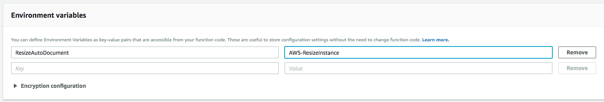

20. Set the function timeout to 30 seconds or more.
21. Click **Save** 

**Creating the Amazon EventBridge Rule for Trusted Advisor**

1. From the AWS Management console make sure to select the us-east-1 region.
2. From the AWS Management console, click on Services and type in EventBridge in the search bar and press enter. 
3. Click on Create rule.
4. Enter ta-highec2util-events in the Name field.
5. Under Define pattern, select **Event pattern**
6. Select **Custom pattern** and paste the following pattern:

	```
	{
	  "detail-type": [
	    "Trusted Advisor Check Item Refresh Notification"
	  ],
	  "source": [
	    "aws.trustedadvisor"
	  ],
	  "detail": {
	    "check-name": [
	      "High Utilization Amazon EC2 Instances"
	    ],
	    "status": [
	      "WARN"
	    ]
	  }
	}
	```

7. Under Select targets, choose Lambda function and select the function you created above: `ta-resize-lambda`.
8. Click **Create**

From this point, Lambda and EventBridge are ready to receive events from Trusted Advisor and kick off the EC2 Resize process, so let's test it.
	
</p></details>


### Step 4 - Testing your Automation

Trusted Advisor won't trigger the event until a real EC2 instance High Utilization has been detected (this could take some time). Therefore to simulate our automation, we will do one of the following:

<details>
<summary> Option 1 - Test your automation by invoking a mock Lambda events
</summary><p>

In this step we will simulate our automation by invoking the Lambda function through the test Event. We will create a test event in lambda function and pass on a mock Trusted Advisor payload to invoke our automation process.

1. From AWS console make sure to select the us-east-1 region.
2. From AWS console, click on Services and type in Lambda in the search bar and press enter. 
	
3. Using the search bar locate the Lambda function you created in this step `ta-resize-lambda`.
4. Click on the function name.
5. Click on **Test** and select Create a new test event.
6. Under Event name field enter `tahighec2utiltestevent`.
7. In the body of the event, copy and paste below content and replace `<instance id>` with the Instance ID from step 0, `<instance region>` with the region where the Instance ID is deployed in step 0 and `<account id>` with your account ID.

**Lambda Function test event**

	```
	{
	  "detail": {
	    "check-item-detail": {
	      "Instance ID": "<instance id>"
	    },
		"resource_id":"arn:aws:ec2:<instance region>:<account id>:instance/<instance id>"
	  }
	}
	```

8. Click **Create**.
9. Ensure the event you created is selected, then click **Test**
10. This should now trigger the AutomationDocument execution.
11. Go to Systems Manager Console in the region where the EC2 instance is provisioned. 
	

12. Click on **Automation** on the left menu.
13. You should be able to see the Automation execution progress (look for the one with waiting status).
14. Wait for an email from SNS notification asking for your approval, click on the approve URL and submit the approval to proceed with approving the request.
15. Watch the EC2 instance being resized from the EC2 Management console.
	

For visibility, here is an example of the event being triggered by TA High Utilization Check.
	
	```
	{  
	   "version":"0",
	   "id":"4d04a964-88a6-7093-74c8-9af26598ca3e",
	   "detail-type":"Trusted Advisor Check Item Refresh Notification",
	   "source":"aws.trustedadvisor",
	   "account":"000000000000",
	   "time":"2018-11-20T01:01:49Z",
	   "region":"us-east-1",
	   "resources":[  
	
	   ],
	   "detail":{  
	      "check-name":"High Utilization Amazon EC2 Instances",
	      "check-item-detail":{  
	         "Day 1":"98.8%",
	         "Day 2":"98.8%",
	         "Day 3":"98.8%",
	         "Region/AZ":"us-west-2c",
	         "14-Day Average CPU Utilization":"98.8%",
	         "Day 14":"98.8%",
	         "Day 13":"98.8%",
	         "Day 12":"98.8%",
	         "Day 11":"98.8%",
	         "Day 10":"98.8%",
	         "Instance Type":"m3.medium",
	         "Instance ID":"i-b6218518",
	         "Day 8":"98.8%",
	         "Instance Name":"Overutilized4",
	         "Day 9":"98.8%",
	         "Number of Days over 90% CPU Utilization":"14",
	         "Day 4":"98.8%",
	         "Day 5":"98.8%",
	         "Day 6":"98.8%",
	         "Day 7":"98.8%"
	      },
	      "status":"WARN",
	      "resource_id":"arn:aws:ec2:us-west-2:753667216438:instance/i-b6218518",
	      "uuid":"e03b12af-004c-412b-9a76-c7d77a907c6d"
	   }
	}
	
	```
</p></details>
	
	
<details>
<summary> Option 2 - Test by triggering mock Amazon EventBridge event through the AWS CLI (optional).
</summary><p>

In this step we test our automation by creating a mock event. We will create another EventBridge rule with `awsmock.trustedadvisor` as the source.
	
We must use awsmock as the source as using "aws." is not permitted for custom events due to security and integrity reasons.

1. From AWS console, click on Services and type in EventBridge in the search bar and press enter. 
2. Click on **Rules**
3. Click **Create rule**
4. Enter ta-highec2util-events in the Name field.
5. Under Define pattern, select **Event pattern**
6. Select **Custom pattern** and paste the following pattern:
	```
	{
	  "detail-type": [
	    "Trusted Advisor Check Item Refresh Notification"
	  ],
	  "source": [
	    "awsmock.trustedadvisor"
	  ],
	  "detail": {
	    "check-name": [
	      "High Utilization Amazon EC2 Instances"
	    ],
	    "status": [
	      "WARN"
	    ]
	  }
	}
	```
	
7. Under Select targets, choose Lambda Function and select the Lambda function you created in step 3.
8. Keep everything else default and click Create.
9. Create a text file and name it **mockpayload.json**
10. Copy and paste the content below, being sure to replace `<instance id>` with the Instance ID from step 0, `<instance region>` with the region where the Instance ID is deployed in step 0 and `<account id>` with your account ID.

	```
	[
	  {
	    "DetailType": "Trusted Advisor Check Item Refresh Notification",
	    "Source": "awsmock.trustedadvisor",
	    "Time": "2019-11-30T00:55:52Z",
	    "Resources": [],
	    "Detail": "{\"check-name\":\"High Utilization Amazon EC2 Instances\",\"check-item-detail\":{\"Instance ID\":\"<instance id>\"},\"status\":\"WARN\",\"resource_id\":\"arn:aws:ec2:<instance region>:<account id>:instance/<instance id>\"}"
	  }
	]	
	```
	
*This custom event payload will represent the Trusted Advisor event for this scenario.*
	
Once you've configured the above rule, and created the **mockpayload.json** file you can trigger the automation by putting a custom EventBridge event with below command.
This step will require you to have AWS CLI installed in your laptop or EC2 instance.
[Click Here](https://docs.aws.amazon.com/cli/latest/userguide/cli-chap-install.html) for instructions on how to install and configure AWS CLI, if you do not have them installed.
	
`aws events put-events --entries file://mockpayload.json`
	
</p></details>

## CloudFormation Template (Optional)

In this section, we will show you how to deploy the resources for this solution (Step 1 to 4) automatically using AWS CloudFormation.

**Note:**

* For the best learning outcome in this workshop, please try to follow the Walkthrough above and only deploy this CloudFormation template as a last resort in case you are not able to follow/complete the Workshop in time.

* The following CloudFormation stack needs to be deployed in us-east-1 for the automation of EC2 resources in us-east-1 only. 

* If your EC2 instance is in other region than us-east-1 you can create individual Approval AutomationDocuments in each region with identical names, e.g: `Custom-TA-Resize-Approval` (follow Step 2 in the walkthrough above). 

* Then specify the name of the AutomationDocument e.g: `Custom-TA-Resize-Approval` in **ResizeAutomationApprovalDocument** parameter when launching the stack below:

<details>
<summary>[ Click here for detailed steps ]</summary><p>

1. Deploy CloudFormation stack using template `ta-automation-highutil-ec2.yml` in the us-east-1 region. 
2. Refer here for instructions on how to deploy Stack [Create Stack](https://docs.aws.amazon.com/AWSCloudFormation/latest/UserGuide/cfn-console-create-stack.html "Create Stack").
3. If you are automating instance resizing outside of **us-east-1**, read the note above and fill in the AutomationDocument name you enterd in the **ResizeAutomationApprovalDocument** parameter. If you leave them blank the automation will only work in **us-east-1**

</p></details>
