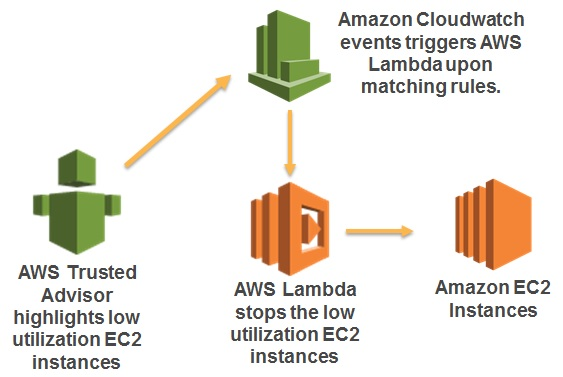

## Trusted Advisor Tools

### Overview
AWS Trusted Advisor provides real time guidance to help users provision their resources following AWS best practices. You can now create configurable, rule-based events for automated actions based on AWS Trusted Advisor’s library of best-practice checks using Amazon CloudWatch Events.
The sample functions provided help to automate Trusted Advisor best practices using Amazon Cloudwatch events and AWS Lambda. 

### Setup and Usage

Setup and usage instructions are present for each tool in its respective directory:  
[Stop Amazon EC2 instances with low utilization](LowUtilizationEC2Instances/)  
[Create snapshots for EBS volumes with no recent backup](AmazonEBSSnapshots/)  
[Delete exposed IAM Keys and monitor usage](ExposedAccessKeys/) 

More information about Trusted Advisor is available here: https://aws.amazon.com/premiumsupport/trustedadvisor/

### License
Trusted Advisor Tools is licensed under the Apache 2.0 License.
