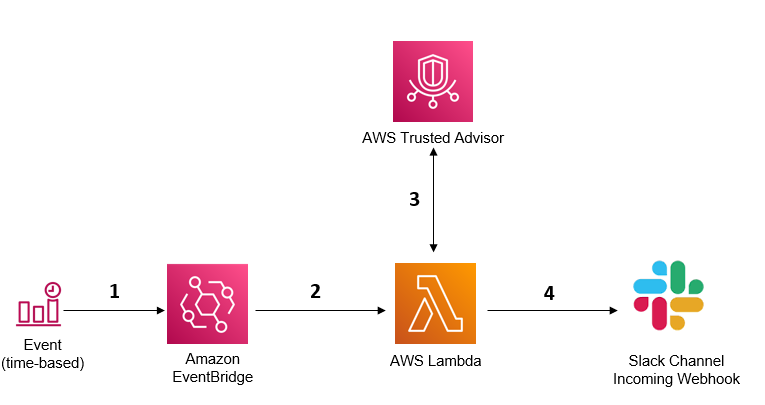

## Slack Integration to post Trusted Advisor Red Findings, w/ Monthly Estimated Costs Savings in an Account

##### Authors: Manas Satpathi and Sandeep Mohanty

### Description/Use-case

Use this solution to report all RED findings from AWS Trusted Advisor for an AWS account to your preferred Slack channel. It also reports the estimated monthly savings reported by Trusted Advisor.

Use this automated solution to get notified for AWS Trusted Advisor findings with status red/error (actions required). High priority Trusted Advisor checks require further investigation as they help you secure and optimize your account to align with AWS best practices. Notifications are classified by risk category (Security, Fault Tolerance, Performance, Cost and Service Limits) and sent to Slack at a preconfigured interval.  Configure the notification interval as a scheduled event rule in Amazon EventBridge. Modify the included python script to customize the solution further to meet your requirements.

An example Slack channel posting using this sample project -

=== Summary of TA High Risk (RED) Findings ===
Total High Risk (RED) Findings: 18 (Security: 8, Fault-Tolerance: 4, Performance: 6)
Total Estimated Monthly Savings: $3,200.32.

HIGH RISK - [security] AWS Lambda Functions Using Deprecated Runtimes
HIGH RISK - [security] Security Groups - Specific Ports Unrestricted
HIGH RISK - [security] Security Groups - Unrestricted Access
HIGH RISK - [fault_tolerance] Amazon EBS Snapshots
HIGH RISK - [fault_tolerance] Auto Scaling Group Resources

### Solution Overview
Deploying this solution automates the process of checking, and delivery of RED alerts from Trusted Advisor to a preconfigured Slack channel via an incoming webhook.

The following diagram illustrates how the solution works,

### Prerequisites
Create an incoming Slack Webhook. Incoming webhooks are a simple way to post messages from 3rd party apps into Slack. Creating an incoming Webhook gives you a unique URL to which you send a JSON payload with the message text and some options. The Account you're using should have AWS Business, On-RAMP, or Enterprise Support to get the estimated monthly savings, and additional TA checks.

Refer to the link below for instructions to create an incoming Slack webhook https://api.slack.com/messaging/webhooks

Copy and save the Slack webhook URL somewhere in a local text file. We will use it later when deploying the solution. Pass this ULR to the Lambda function to post curated events from Trusted Advisor to a Slack channel.

The webhook URL should look something like this https://hooks.slack.com/workflows/T01234ABCD/A03PQRST/12345678/ab6c20hdWBZabcd

More information about AWS Trusted Advisor is available here: https://aws.amazon.com/premiumsupport/trustedadvisor/

### How it works
    1. An EventBridge rule is configured to invoke a Lambda function on a pre-configured schedule. For example, hourly, every 12 hours,daily, etc.

    2. EventBridge invokes the Lambda function and passes the Slack Webhook URL as an argument to the Lambda function.The JSON input event to the Lambda function look something like this,              
       {
          "SlackWebhookURL": "https://hooks.slack.com/workflows/T01234ABCD/A03PQRST/12345678/<string>"
       }

    3. Lambda invokes Trusted Advisor APIs to get the current point in time status of all checks that are in the RED (Action Required) state

    4. Lambda formats the response from Trusted Advisor, and sends a summary of all checks, along with details of all open high-risk items to Slack, organized by risk category (Security, Fault Tolerance, Performance, Cost and Service Limits).

### Deploy the solution

The solution includes the following files

**TA-Red-Slack-Webhook.py**  
Python script for the Lambda function. 

**CF-TA-Red-Slack-Webhook.yml**  
CloudFormation template, with inline code to automatically deploy the solution.   

### Using CloudFormation

Use the CloudFormation template CF-TA-Red-Slack-Webhook.yml to deploy the solution.  Provide the following inputs to CloudFormation input parameters when prompted,

**1. ScheduleExpression**
Enter an interval for the scheduler to run, e.g. every 12 hours, etc., or an EventBridge cron pattern.  
Ref: https://docs.aws.amazon.com/eventbridge/latest/userguide/eb-create-rule-schedule.html#eb-rate-expressions

**2. SlackWebhookURL**
Enter the Slack Webhook URL you created earlier as the input event to the Lambda function in JSON, as shown below, 
{
  "SlackWebhookURL":"https://hooks.slack.com/workflows/T01234ABCD/A03PQRST/12345678/<string>"
}

### Manual Deployment – Step by Step

The steps below let you manually deploy and customize the solution to meet your needs

    1. Create a Slack Webhook corresponding to a channel in Slack

    Refer to the link below for instructions to create an incoming Slack webhook 
    https://api.slack.com/messaging/webhooks

    2. Create the Lambda function 
    - Using the provided Python script TA-Red-Slack-Webhook.py create a Lambda function in your account. 
    - To give Lambda access to Trusted Advisor, add the permissions below to the default Lambda execution role.
       {
          "Version": "2012-10-17",
          "Statement": [
            {
                "Action": [
                    "support:DescribeTrustedAdvisorCheckRefreshStatuses",
                    "support:DescribeTrustedAdvisorCheckResult",
                    "support:DescribeTrustedAdvisorCheckSummaries",
                    "support:DescribeTrustedAdvisorChecks"
                ],
                "Resource": "*",
                "Effect": "Allow"
            }
        ]
      }

    For additional details on configuring the Lambda execution role, see
    
    ### AWS Lambda execution role
    https://docs.aws.amazon.com/lambda/latest/dg/lambda-intro-execution-role.html

    3. Create an Amazon EventBridge rule
       - Create a rule in Amazon EventBridge that runs on a schedule
       - You may choose the “default” Event bus for this rule
       - Enter an interval for the scheduler to run, e.g. every 12 hours, etc., or an EventBridge cron pattern. 
         Ref: https://docs.aws.amazon.com/eventbridge/latest/userguide/eb-create-rule-schedule.html#eb-rate-expressions

       - Configure a Lambda target. Select the Lambda function created in Step 1. 
       - Under “Additional settings” for the target, select “Constant (JSON text)”, and then enter the input event to the Lambda function in JSON as follows,
           {
              "SlackWebhookURL": "<Replace with Slack Webhook URL you created earlier>"
           }
       - You may leave other settings as default, or refer to the product documentation for additional details at, 
         Ref: https://docs.aws.amazon.com/eventbridge/latest/userguide/eb-rules.html
       - Review and Create rule. 

       For more information about creating an Amazon EventBridge rule that runs on a schedule, see  
       https://docs.aws.amazon.com/eventbridge/latest/userguide/eb-create-rule-schedule.html

### Security

See [CONTRIBUTING](CONTRIBUTING.md#security-issue-notifications) for more information.

### License

This library is licensed under the MIT-0 License. See the LICENSE file.

