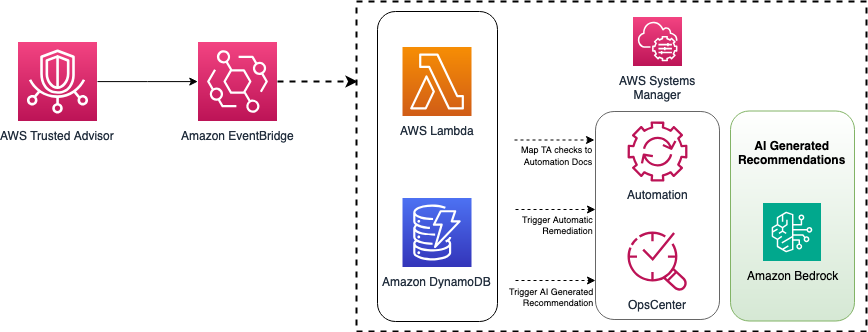
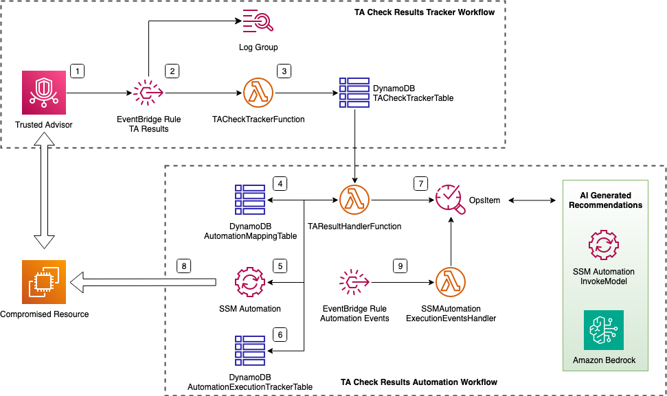
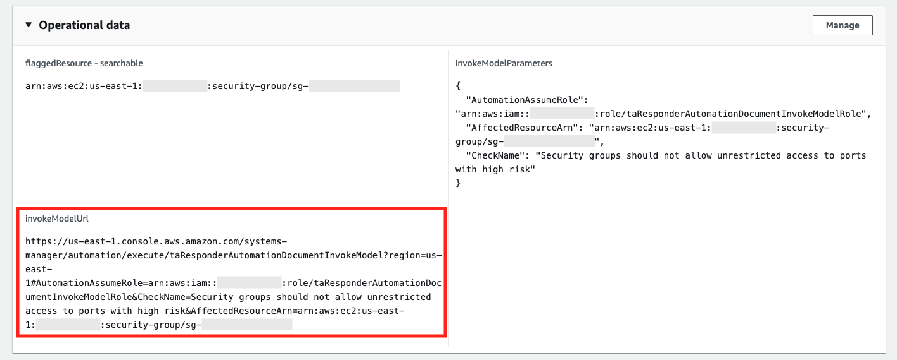
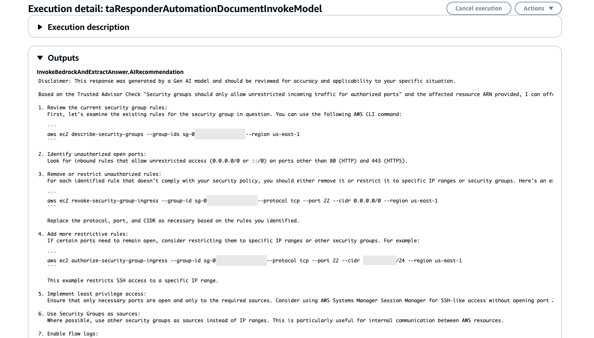

# Trusted Advisor Responder



Author: Carlos Perez

## What does this solution do?

Trusted Advisor Responder is a proof-of-concept solution that demonstrates how to leverage AWS Trusted Advisor (TA) recommendations in conjunction with AWS Systems Manager Automation for automatic remediation of issues. This solution serves as a control plane for mapping AWS Systems Manager Automation documents to Trusted Advisor Recommendations check findings, enabling automatic remediation of issues identified by TA. Additionally, it integrates with Amazon Bedrock to provide AI-generated recommendations for cases where automated remediation may not be possible, offering a comprehensive approach to cloud optimization and management.

Key features:
- Automated response to Trusted Advisor recommendations
- Mapping of TA checks to SSM Automation documents
- Integration with Amazon Bedrock for AI-generated recommendations
- Comprehensive tracking and monitoring of remediation processes
- Handling of both automatable and non-automatable issues through a combination of automation and AI-assisted recommendations

<details>

<summary>More Details</summary>

**Detailed architecture diagram**



The solution deployed mainly comprises of two workflows:

* **Trusted Advisor (TA) Check Results Tracker Workflow:** By design, every time there is an update in a Trusted Advisor check result, TA sends two events to EventBridge. One event contains details about the previous check status, and the other contains the new check status details. This part of the architecture is intended to keep track of the most recent TA check result updates in a DynamoDB table.

* **Trusted Advisor (TA) Check Results Automation Workflow:** This part automates remediation using AWS Systems Manager Automation documents, tracks automation executions, and manages the lifecycle of corresponding OpsItems in Systems Manager.

**Trusted Advisor Responder Workflow Steps**

1. A Trusted Advisor Recommendation check result is updated and sent to EventBridge as a Trusted Advisor generated event.

2. The EventBridge Rule forwards events to the TrustedAdvisorCheckTrackerFunction Lambda function and a CloudWatch Log Group.

3. The TrustedAdvisorCheckTrackerFunction updates the TrustedAdvisorCheckTrackerTable DynamoDB table with the most recent status of TA checks.

4. The TrustedAdvisorResultsHandlerFunction processes new TA check results and checks the AutomationMappingTable for corresponding mappings.

5. If a mapping is found, the TrustedAdvisorResultsHandlerFunction triggers the SSM Automation Document.

6. The TrustedAdvisorResultsHandlerFunction updates the AutomationExecutionTrackerTable to track automation executions.

7. An OpsItem is created with details about the compromised resource and executed automation document.

8. The SSM Automation Document remediates the issue in the compromised resource.

9. The SSMAutomationExecutionEventsHandler Lambda function updates the OpsItem with execution details and closes or leaves it open based on the results.

If the Amazon Bedrock integration is enabled, users will have the option to trigger a SSM Document part of this solution for invoking a selected Bedrock LLM model to get additional recommendations on fixing TA check findings. Especially useful for cases without predefined automation documents in place.
</details>

## Pre-requisites

1. AWS Account with at least [Business Support plan](https://aws.amazon.com/premiumsupport/plans/) enabled (For access to all [AWS Trusted Advisor](https://docs.aws.amazon.com/awssupport/latest/user/trusted-advisor.html) checks and recommendations)
2. AWS Config and AWS Security Hub must be enabled in the target region. If not already enabled, you can download the [tatools-ta-responder-infra-setup.yaml](cfn_templates/tatools-ta-responder-infra-setup.yaml) CloudFormation template and deploy it in the AWS region(s) where you are running your workloads.
   - Trusted Advisor can act as a single pane of glass for your Cloud Optimization efforts. For this reason, apart from its built-in checks, Trusted Advisor integrates and consumes recommendations results from different AWS Hubs and optimization and compliance services such as AWS Config, Compute Optimizer, Resilience Hub and Security Hub. This proof-of-concept solution is currently leveraging the integration with the AWS Config and Security Hub results. 
3. (Optional) Access to desired Bedrock LLM Model (default: Claude 3.5 Sonnet). Make sure that you have [requested access to the LLM Model](https://docs.aws.amazon.com/bedrock/latest/userguide/model-access-modify.html) that you would like to use.

## Instructions to deploy

1. Download the [tatools-ta-responder-setup.yaml](cfn_templates/tatools-ta-responder-setup.yaml) CloudFormation Template.
2. Open the [CloudFormation Console](https://console.aws.amazon.com/cloudformation/) in **us-east-1 region** and choose **Create stack > With new resources (standard)**. (Note that Trusted Advisor is a global service and all Events it emits to EventBridge are to be handled in us-east-1 region).
3. Select **Upload a template file** and upload the downloaded template. Click **Next**.
4. Name your stack (e.g., `TA-Responder-Stack`) and configure parameters:
   - **GenAIRecommendationsEnabled**: Enable or disable the Gen AI recommendations integration of this solution. When enabled, the stack will create a System Manager Automation document that will allow end users to retrieve further recommendations regarding a particular Trusted Advisor check's finding.
   - **GenAIModelId**: The [Bedrock Model ID](https://docs.aws.amazon.com/bedrock/latest/userguide/model-ids.html#model-ids-arns) to be used for Gen AI recommendations. Only if "GenAIRecommendationsEnabled" is set to 'true', otherwise ignored. By default, this is set to use Claude 3.5 Sonnet.
5. Click **Next** through the subsequent pages, review, and click **Submit** to create the stack.
6. Wait for the stack creation to complete.

## [Optional] Testing the solution

<details>

<summary>Expand to see an example of leveraging this solution</summary>

As an example, this section guides you through setting up the solution to map the TA check "Security groups should not allow unrestricted access to ports with high risk" with the SSM Automation document [AWS-DisablePublicAccessForSecurityGroup](https://docs.aws.amazon.com/systems-manager-automation-runbooks/latest/userguide/automation-aws-disablepublicaccessforsecuritygroup.html). So that any findings from this TA check will be automatically remediated my the mapped SSM document.

#### 1. Creating a new mapping

In the following steps you will add a new automation mapping item into the **AutomationMappingTable** DynamoDB table. This item defines the configuration so that the automation workflow of this solution detects and uses the correct SSM Automation Document (e.g., *"AWS-DisablePublicAccessForSecurityGroup"*) for remediating findings from the Trusted Advisor check result (e.g., *"Security groups should not allow unrestricted access to ports with high risk"*).

1. Open the CloudFormation console and locate the stack you have just created.
2. Copy the `AutomationRoleArn` value from the Outputs tab.
3. Replace `<AutomationRoleArn-output>` in the following command with the copied value, then run it in [AWS CloudShell](https://console.aws.amazon.com/cloudshell/home):

> **Note -** The IAM role used here is created as part of this CloudFormation stack for this test example, and it has the necessary permission for the *"AWS-DisablePublicAccessForSecurityGroup"* document to execute successfully. In a real scenario, you would need to [create and manage the IAM service roles](https://docs.aws.amazon.com/systems-manager/latest/userguide/automation-setup.html#automation-setup-configure-role) for the specific SSM automation documents you plan to use.

```bash
aws dynamodb put-item \
    --table-name AutomationMappingTable \
    --item '
{
    "checkName": {
        "S": "Security groups should not allow unrestricted access to ports with high risk"
    },
    "ssmAutomationDocument": {
        "S": "AWS-DisablePublicAccessForSecurityGroup"
    },
    "automationParameters": {
        "S": "{\"GroupId\": [\"$resourceId\"], \"AutomationAssumeRole\": [\"<AutomationRoleArn-output>\"]}"
    },
    "regexPattern": {
        "S": "(sg-\\w+)"
    },
    "automationStatus": {
        "BOOL": true
    }
}'
```

* **checkName:** The name of the Trusted Advisor check we are creating a mapping for.
* **ssmAutomationDocument:** The name of the SSM Automation Document that you will be using for remediating the risk found by the TA check.
* **automationParameters:** These are the parameters needed to successfully run the defined SSM Automation Document. For example, in the case of [AWS-DisablePublicAccessForSecurityGroup](https://docs.aws.amazon.com/systems-manager-automation-runbooks/latest/userguide/automation-aws-disablepublicaccessforsecuritygroup.html), you are required to define the **GroupId** parameter. In the **AutomationAssumeRole**, you are defining the IAM role that Systems Manager will use when running this automation document.
* **regexPattern:** This is a regex pattern that will be used by the **TrustedAdvisorResultHandlerFunction** Lambda logic in this workflow to parse the Security Group ID from the TA check results and add it into the **GroupId** parameter when executing the automation.
* **automationStatus:** If *true*, the SSM automation document will be executed for this particular TA check <> SSM Automation Document mapping. If *false*, the automation won't be executed.

#### 2. Trigger Trusted Advisor Security Check

Create a Security Group allowing SSH (Port 22) inbound traffic from anywhere using AWS CLI in CloudShell:

```bash
VPC_ID=$(aws ec2 describe-vpcs --query 'Vpcs[0].VpcId' --output text)

SG_ID=$(aws ec2 create-security-group --group-name open-security-group-test --description "Open Security Group" --vpc-id $VPC_ID --query "GroupId" --tag-specifications "ResourceType=security-group,Tags=[{Key=automaticRemediation,Value=True}]" --output text)

aws ec2 authorize-security-group-ingress --group-id $SG_ID --protocol tcp --port 22 --cidr 0.0.0.0/0
```

> **Note -** The mapped automation SSM document is only automatically triggered if the automation is enabled at the AutomationMappingTable DDB table level (as our control plane for SSM Documents <-> TA Check mapping), and at the resource tag level with a tag "automaticRemediation=True" added to the resource. For more details about enforcing tagging visit the public [Best Practices fo Tagging AWS Resources](https://docs.aws.amazon.com/whitepapers/latest/tagging-best-practices/implementing-and-enforcing-tagging.html) documentation.

#### 3. Verify the Automation Workflow

1. Check for a new OpsItem titled "[TA] [Security groups should not allow unrestricted access to ports with high risk]" in the [OpsCenter Console](https://console.aws.amazon.com/systems-manager/opsitems).
2. Verify that the SSM Automation Document `AWS-DisablePublicAccessForSecurityGroup` was triggered in the [Automations execution page](https://console.aws.amazon.com/systems-manager/automation/executions).
3. Once completed, check the [EC2 Security Groups Console](https://console.aws.amazon.com/ec2/#SecurityGroups) to confirm the inbound rule was removed.
4. Review the resolved OpsItem in OpsCenter for execution details.

#### 4. Triggering the Bedrock Automation Document
  
> **Note -** The intention with below two steps is to showcase how you can leverage the Bedrock integration part of this solution. As for this particular example, there is already a SSM automation document <-> TA check mapping, so invoking the model for steps on how to fix would be actually redundant in this particular case.

1. Open the same OpsItem in OpsCenter and locate the `invokeModelUrl` field in the OpsItem's Operational Data section. Copy this URL into another tab of your web browser to load a SSM document for invoking the Bedrock model with all the necessary input parameters already in place.



2. Execute the automation runbook to receive AI-generated recommendations for the specific issue. Below and example output:



</details>

## Introduction to AMS Trusted Remediator solution

For those interested in a fully managed solution, [AWS Managed Services (AMS)](https://aws.amazon.com/managed-services/) offers the [**Trusted Remediator**](https://docs.aws.amazon.com/managedservices/latest/accelerate-guide/trusted-remediator.html) solution as part of their [AMS Accelerate](https://docs.aws.amazon.com/managedservices/latest/accelerate-guide/what-is-acc.html) offerings. This solution provides automated remediation of AWS Trusted Advisor checks, improving security, performance, and cost optimization across your AWS accounts.

Key benefits of AMS Trusted Remediator:
- Automated remediation based on best practices
- Self-service setup and configuration
- Scheduled execution aligned with your operational workflows
- Integration with existing AWS services like Systems Manager and AppConfig

While the "Trusted Advisor Responder" proof-of-concept in this repository demonstrates the potential of automating Trusted Advisor remediation, the AMS Trusted Remediator offers a more comprehensive, managed approach suitable for enterprise-scale deployments.

For more information on AMS Trusted Remediator, contact your AWS account team or refer to the [AMS documentation](https://docs.aws.amazon.com/managedservices/latest/accelerate-guide/getting-started-acc.html).