# TA-WA Optimization - starter

Author / Contributor
* Stephen Salim
* Carlos Perez


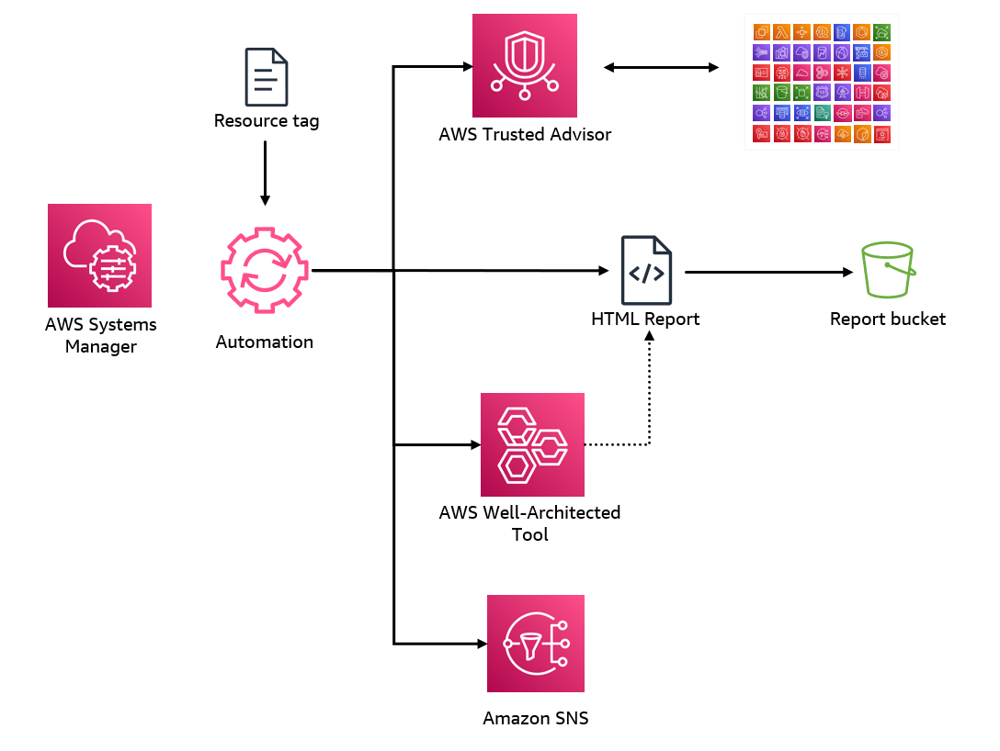


## What does this sample automation do ?

This sample solution's objective is to aid Cloud optimization review, using Well-Architected framework. 

The solution compiles a list of resource configurations, that are not aligned with AWS known best practices, leveraging AWS Trusted Advisor.

Below is the detailed solution's breakdown.

1. To use the solution, customer can run the an AWS Systems Manager Runbook ( Automation Document ) called `TrustedAdvisor-WellArchitected-Optimization-Starter`, entering a few input parameters. Including the [AWS Well-Architected Tool](https://aws.amazon.com/well-architected-tool/) workload name to be use for the optimization review.

2. The AWS Systems Manager Runbook, will then  call an [AWS Lambda function](https://aws.amazon.com/pm/lambda/) asyncronously, and wait for the Lamba function to complete, using the `aws:approve`  [action](https://docs.aws.amazon.com/systems-manager/latest/userguide/automation-action-approve.html).

3. The Lambda function will first create, a temporary AWS Well-Architected Tool workload in `us-east-1` region, with the AWS Trusted Advisor discovery enabled. And gather all the mappings,  between Trusted Advisor Checks and Well-Architected Framework best practices. 

4. Once this mapping is populated, the Lambda function will then compile the list of AWS resources, detected by Trusted Advisor checks in the mapping.  And compile a HTML report, placed in an [Amazon S3](https://aws.amazon.com/pm/serv-s3/) bucket.

5. The URL to access the HTML report will placed in the note section of related Questions for best practices in the specified Well-Architected Tool workload in step 1. 

6. The HTML report will also be sent to the user via email. 


<details>
<summary>[ Click here for detailed diagram ]</summary>

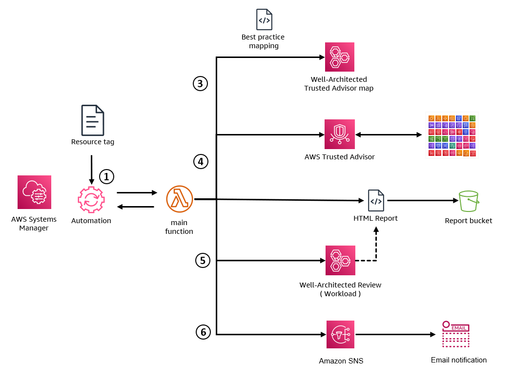

</details>


## Deploy Systems Manager Automation Document

1.  Follow the instruction [here](https://docs.aws.amazon.com/serverless-application-model/latest/developerguide/install-sam-cli.html) to Install SAM CLI.

2.  Run below commands to deploy the AWS Systems Manager Runbook and other supporting 


    ```
    sam build 
    sam deploy --guided --resolve-s3 --capabilities CAPABILITY_NAMED_IAM
    ```

3.  Enter values of below parameters, and select default for the rest of the prompts

    - **Stack Name** = This is the CloudFormation stack name containing all the solution resources.
    - **AWS Region** = This is the AWS Region where the CloudFormation stack will be created.
    - **TAResourceReportBucket** = This is the S3 Bucket name where the solution will place the report. ( A new S3  bucket will be created, make sure the bucket is unique   )
    - **UseReportOwnURL** = This is the url prefix to access the report stored in S3 bucket ( Include https:// in the field). If left empty, the AWS Console URL will be used. 
    - **NotificationEmail** = This is the email address to notify users of the report url.
    
    
        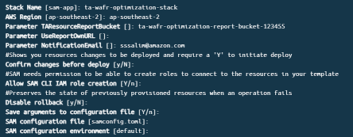
    
4. Check the Email Inbox of your specified email address in **NotificationEmail** parameter above, and click confirm subscription

    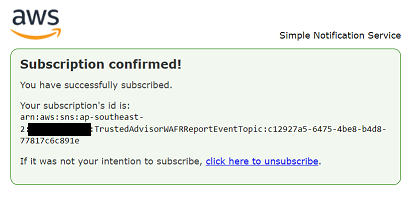


## Running Systems Manager Automation Document

1. Open AWS Systems Manager Console 
2. Click  **Documents** on the left menu area.
3. Then under  **Owned by me** tab , Click on the Automation Document called `TrustedAdvisor-WellArchitected-Optimization-Starter`.  

    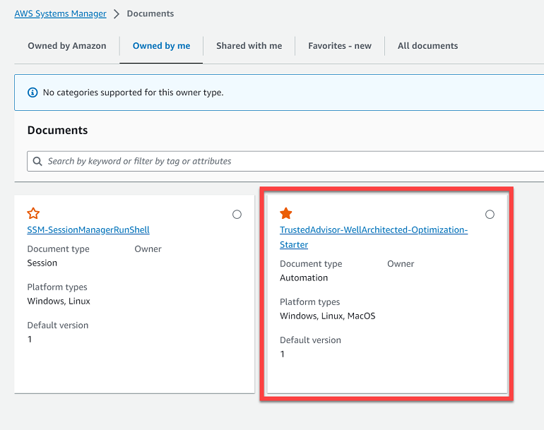
    
4. Click `Execute Automation` and fill in the Input parameters. Particularly the `BestPracticeReviewName`.

    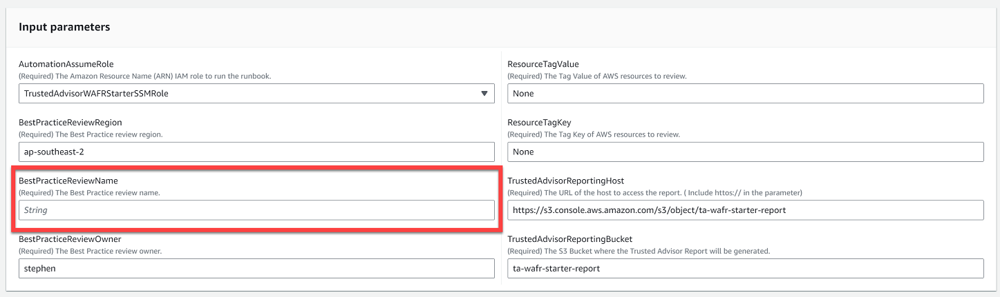
    
5. Wait until all Steps are completed ( this takes approx 10 minutes).
    
    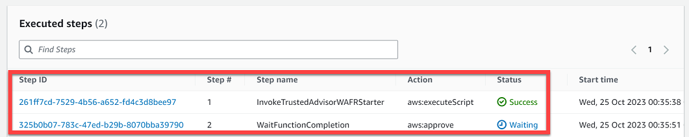

6. Once all steps are completed successfully. 


7. Locate and run Review in the workload you specified, under the AWS Well-Architected Tool Console.

    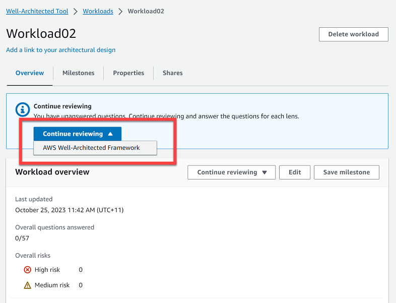

8. Under the Notes section of Well-Architected questions, locate the URL to access the report. 

    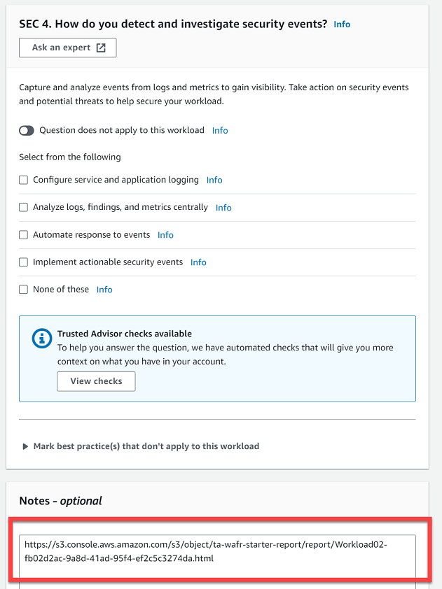

9. Download the report

    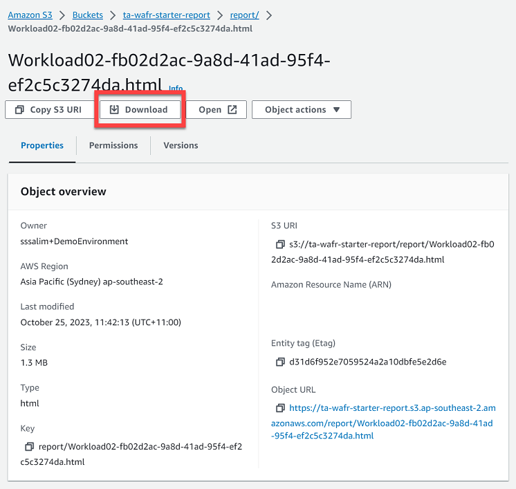

10. Review the report

    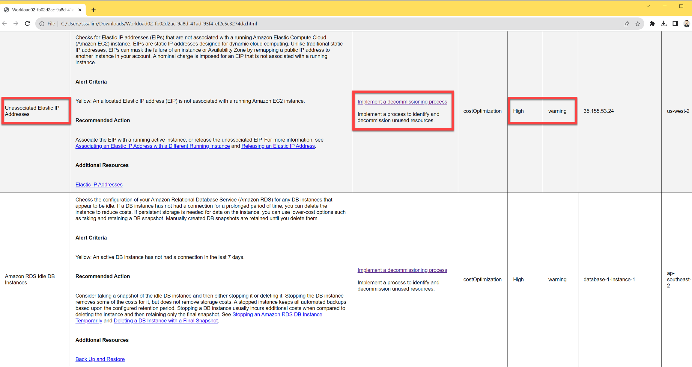

## Cleanup

1. Delete the report S3 Bucket you specified **TAResourceReportBucket** during creation of the Stack.

2. Run below commands to delete the stack, and select yes for all prompts to delete resource.


    ```
    sam delete --stack-name {{ Stack Name }}
    ```

## Bonus Section - Eisenhower Matrix App to help prioritizing Trusted Advisor Checks results based on Business Impact and Urgency

<details>
<summary>[ Click here to expand this BONUS section ]</summary>

**Important Note:** This Eisenhower Matrix App is a react front-end only application. This means that no data is stored in any backend server or component while using the app (all data remains client side).

**Prerequisite:** Before proceeding with below steps, make sure you have [installed Node.js and npm](https://docs.npmjs.com/downloading-and-installing-node-js-and-npm)

### Option 1 - Install and Run the Eisenhower Matrix App Locally

1. Navigate to the Eisenhower Matrix App directory from your local copy of this repository ``/Trusted-Advisor-Tools/TA-WellArchitected/tawa-eisenhower-matrix-app``.

E.g. If your current directory is ``tawa-optimization-starter``, navigate to the right directory as below:

```
cd ..

cd tawa-eisenhower-matrix-app
```

2. Install dependencies and start the application:
```
npm install

npm run start
```

3. Open the Eisenhower Matrix App a web browser via: http://localhost:3000

### Option 2 - Host the Eisenhower Matrix App in AWS Amplify Hosting

1. Navigate to the Eisenhower Matrix App directory from your local copy of this repository ``/Trusted-Advisor-Tools/TA-WellArchitected/tawa-eisenhower-matrix-app``.

E.g. If your current directory is ``tawa-optimization-starter``, navigate to the right directory as below:

```
cd ..

cd tawa-eisenhower-matrix-app
```

2. Install dependencies and Build the application. After doing this, the ``/build`` directory will be created inside the current directory: 
```
npm install

npm run build
```

3. Open the [AWS Amplify Console](https://us-east-1.console.aws.amazon.com/amplify/home?region=us-east-1#/) and click on **"Get Started"** for using Amplify Hosting. Or, if this is not your first AWS Amplify app, click on **"New app" > "Host web app"**:

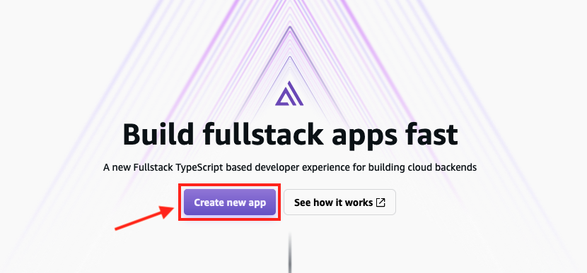

4. Select **Deploy without Git provider**:

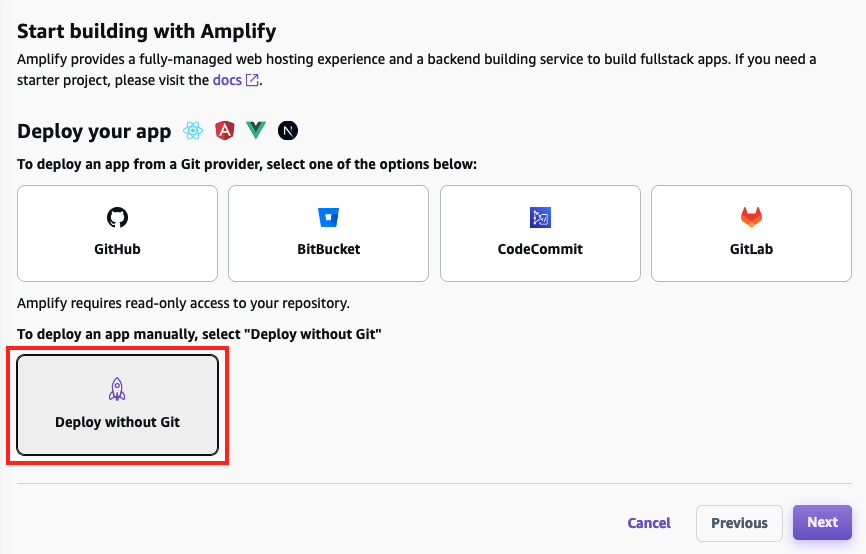

5. In the **Manual deploy** page, fill in the **App name** and **Environment name** fields. For **Method**, select **"Drag and drop"**. Drag and drop the ``/build`` directory created before into the section, and click on **Save and deploy**:

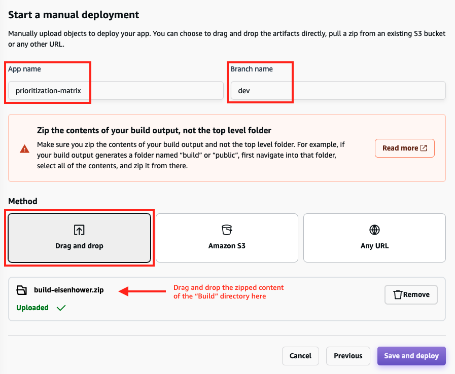

6. Once the deployment is completed, click on the Domain link generated by Amplify to open the Eisenhower Matrix App:

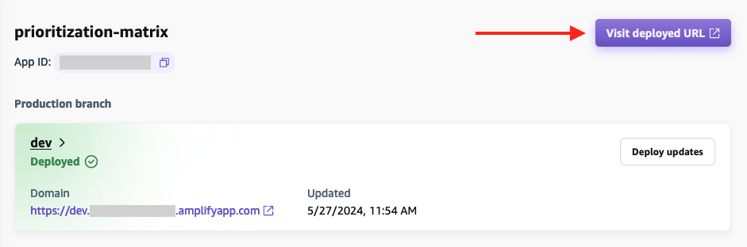

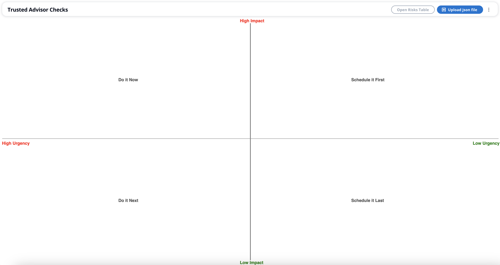

### Load the Trusted Advisor Check results into the Eisenhower Matrix App

Now that the Eisenhower Matrix App is running (either locally or via AWS Amplify), you need to load the Trusted Advisor Check results gathered from the **TA-WA Optimization** automation in previous steps.

**Important Note:** This Eisenhower Matrix App is a react front-end only application. This means that no data is stored in any backend server or component while using the app (all data remains client side).

1. Open the same S3 report link you opened during the **Step 8** under **Running Systems Manager Automation Document** section above.

2. Navigate to the **report/** directory of that S3 bucket:

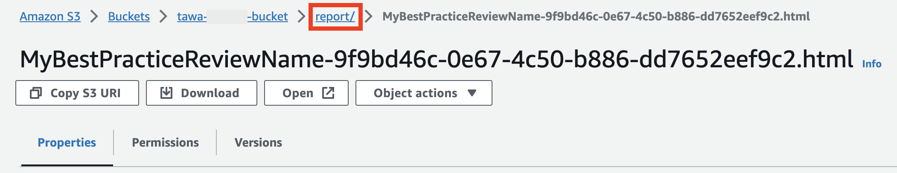

3. Open the **json/** folder:

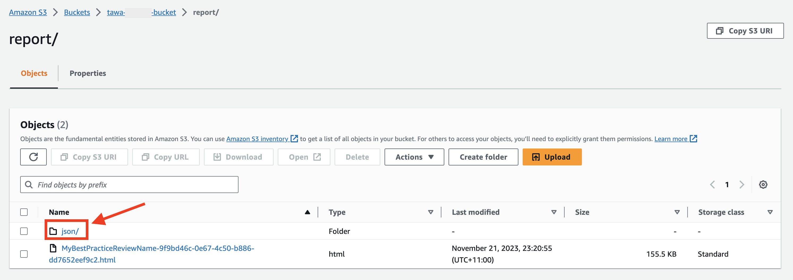

4. Select the **.json** report and click on **Download**:

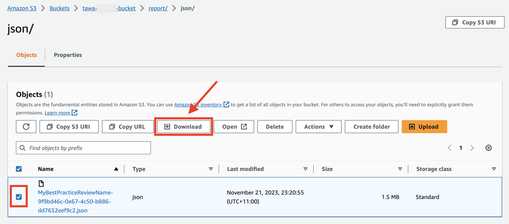

5. Open the Eisenhower Matrix App and click on **Upload json file**:

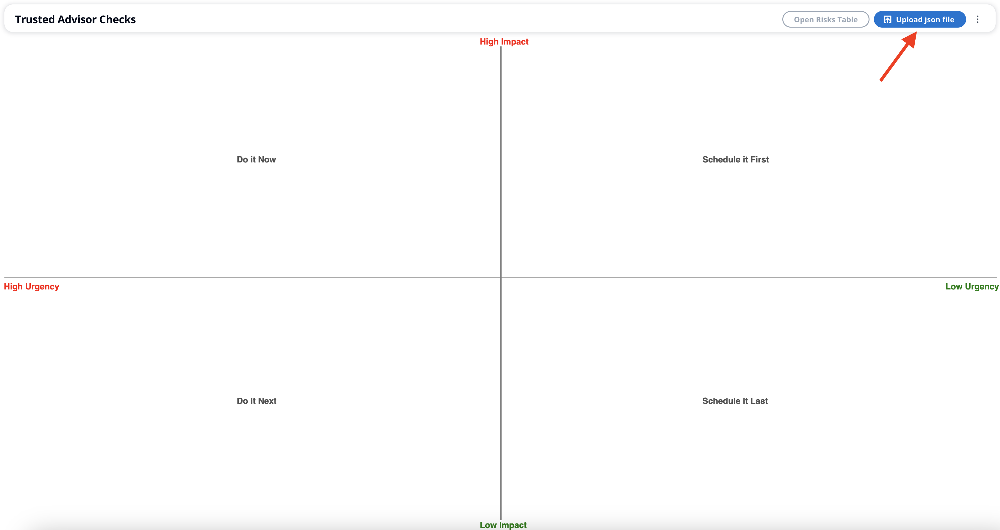

6. After loading the file into the application, the Trusted Advisor Checks table should open. Use this table to select the checks you would like to start prioritizing in the dashboard (Eisenhower Matrix):

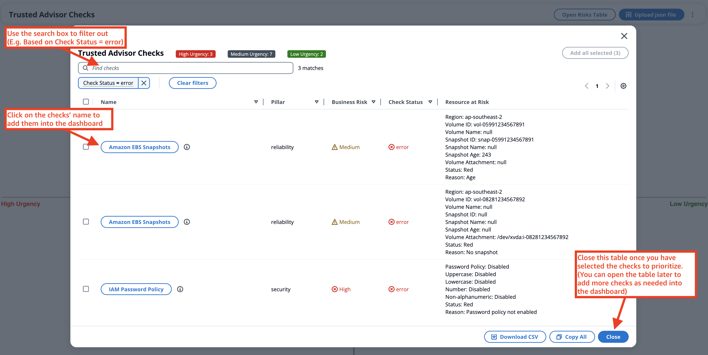

7. Now, you can start prioritizing the checks based on the Business Impact and Urgency by moving the boxes to the different quadrants of the dashboard (Eisenhower Matrix):

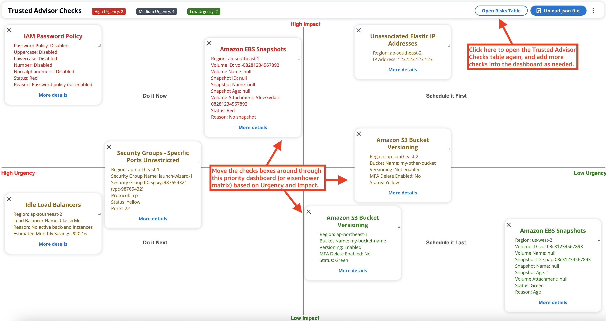

### Cleanup (In case deployed via AWS Amplify)

1. In the AWS Amplify Console, open your application and click on **"Actions" > "Delete app"**:

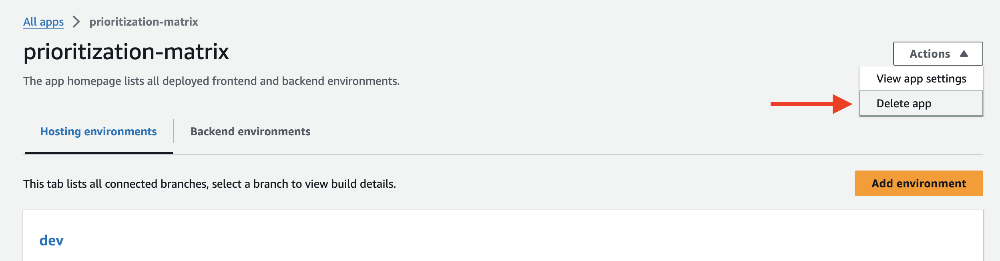

2. In the confirmation window, type *"delete"* and click on the **"Delete"** button:

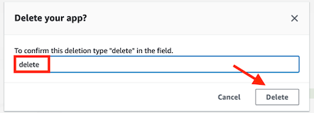

</details>


