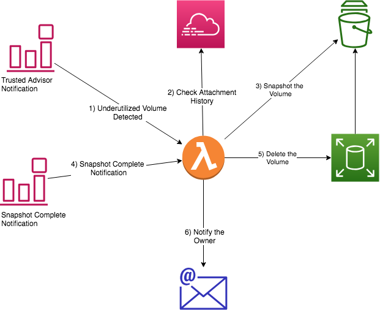

# Underutilized Amazon EBS Volumes

Underutilized EBS volumes can occur for a number of reasons. Over time the cost of these volumes can become substantial. This application can dramatically reduce your EBS costs by safely deleting EBS volumes that are not attached to an instance and have not been attached for many days.

**Warning:** do not install or activate this automation in environments where EBS volumes should not be deleted (e.g. where the data is needed immediately and restoring from snapshot is not an option).  

## Overview

This is an example of how to setup cross-region automation with Trusted Advisor, Cloudwatch, SNS, and Lambda. We strongly recommend testing it and tailoring to your environment before using in your production environment.

This is a serverless (Lambda) application that reacts to Trusted Advisor warnings via CloudWatch rules to detect and delete Underutilized EBS volumes - volumes that have been unattached or had low I/O for a number of days. The app will only delete idle, unattached volumes after successfully taking a snapshot. It sends an email with information on how to recover the volume from the snapshot.

This application is an example of decoupling and asynchronous processing. Trusted Advisor detects a condition. A CloudWatch Event Rule recognizes the event and sends it to a Lambda function for processing. The Lambda creates a snapshot and processing for that event ends. The successful snapshot's completion event is picked up by a CloudWatch Event Rule and routed to the same Lambda function. The Lambda completes processing by deleting the volume and notifying the owner. Note that this could be further decoupled by paring off the notification process and using Amazon SQS to queue the notifications for processing.

This application makes use of several service APIs:

- CloudWatch to detect Trusted Advisor events
- Simple Notification Service (SNS) to route events to Lambda
- EC2 to get volume and snapshot information, create snapshots, and delete volumes
- SES to send email notifications
- CloudTrail to search attachment history

The principle of least privilege is followed such that the Lambda function has only the access required to perform its tasks.

### Automatic Volume Deletion

* must be more than **IdleThresh** days old
* must not have been attached for more than **IdleThresh** days
* does not have the **IgnoreTag** tag
* Lambda must have **EnableAction=True**
* Only deleted after successful snapshot

### How it Works

1. Trusted Advisor updates automatically every 24 hours. Events are sent to CloudTrail in the US-EAST-1 region for any findings. Each "Underutilized EBS Volume" finding is picked up by a CloudWatch Event Rule and routed to the TAEBSVolumeSnapDelete Lambda
2. The Lambda function:
	* Checks the number of days the volume has not been attached to an instance
	* Checks for the ExceptTag tag on the volume and ignores the volume if found
3. If idle for more than **IDLETHRESH** days then a snapshot is created
4. Snapshot executes asynchronously. When complete it signals the Lambda again via a CloudWatch rule
5. If successful then the Lambda verifies the tags on the snapshot and deletes the volume only if it has the tags **SnapshotReason** and **DeleteEBSVolOnCompletion** = "True" (set from EnableActions)
6. Sends an email to the address in the **MailTo** environmental variable and also to the address in the tag configured in **MailToOwner** with instructions on how to rehydrate the volume.

#### Cross-Region Details ####

This application is also an example of cross-region automation. The main component, the Lambda function, runs in US-EAST-1. Since the application runs in the control plane, it does not require a VPC or internet access and has no access to customer data; only to customer infrastructure.

For this application to work cross-region the Lambda creates some additional infrastructure. In each region it will create an SNS topic, **TAEBSVolSnapDelTopic**, that is allowed to send notifications to the US-EAST-1 Lambda, **TAEBSVolumeSnapDelete**. It creates a CloudWatch Event Rule in each region to recognize Snapshot completion. All Snapshot events are sent from the rule to the SNS Topic to the Lambda via SNS subscription. Snapshots that are not for volume deletion (do not have the **SnapshotReason=Idle Volume** tag) are ignored.

## Installation

**Important:** This application must be loaded in **US-EAST-1**, regardless of your cloud deployments. It runs outside of VPC and needs access to Trusted Advisor events. Trusted Advisor is a Global service that runs only in US-EAST-1. For more information, please contact your AWS Account Team.

Choose **Launch Stack** to launch the CloudFormation template in the US East (N. Virginia) Region in your account:

Alternatively, you can use the following instructions to install from your own S3 bucket:

1. Download http://http://aws-trusted-advisor-open-source-us-east-1.s3.amazonaws.com/cloudformation-templates/TAT-UEBS/TASnapandDelete.zip
2. Extract the TASnapandDelete.zip file to a convenient location on your computer
3. Upload the contents to a folder on an S3 bucket *in US-EAST-1*.
4. From S3, get the url of the file **TASnapandDeleteEBS.yaml**
5. Use CloudFormation to install the template from S3 using the url copied in Step 3
6. Configure the template parameters as described in **Configuration** below. You will need the bucket name and prefix (folder) where you uploaded the zip file contents.
7. After successful completion, run in EnableActions=False mode until you are comfortable with the results. See **Testing**

## Configuration

Configuration is done via environmental variables on the Lambda function.

### IdleThresh

Sets the number of days that a volume must be unattached before being automatically deleted.

### IgnoreTag and IgnoreTagVal

**IgnoreTag** names a tag that, if present, will cause the app to ignore the volume. You may also optionally specify **IgnoreTagVal** - if present it will ignore the volume only when the tag is present with this value.

### MailtoOwnerTag

Specifies a tag on the volume that contains the email address of the owner. The owner will be emailed if their volume is deleted. This flexibly lets you use existing tags that have the owner's email address. The default is 'Owner'. Note that this is the only way to get notifications to a specific email for a specific volume.

### Mailto

Email address that will receive all deleted volume reports. You could use an admin's email or a mailing list. Again, *all* reports go to this address. There is no default and it is not required. If not specified and there is no MailtoOwnerTag then *no notifications are sent.*

### FromEmail

The email address from which the notifications will come. This email address must be verified in Simple Email Service using instructions here. [https://docs.aws.amazon.com/ses/latest/DeveloperGuide/verify-email-addresses.html](https://docs.aws.amazon.com/ses/latest/DeveloperGuide/verify-email-addresses.html)

### EnableActions

If **True** then automatic deletion is enabled. If **False** it will not actually delete the volume (but will create a snapshot every time the Trusted Advisor notification is sent).

Note that if **EnableActions** is False then in effect idle volumes will get a daily snapshot. Due to the incremental nature of snapshots the cost will be relatively flat (the cost of a single snapshot) as data is not changing, therefore incrementally the snapshots are very small. That said, don't run it needlessly in EnableAction=False mode for long periods.

Also note that volumes with attachments (attached to an instance, for example) will not and can not be deleted. Only unattached volumes, and only after a successful snapshot.

## Testing

1. Use an account that has underutilized volumes (or create some)
2. Leave **EnableActions = False** on the TAEBSVolumeSnapDelete Lambda (see environmental variables)
3. Wait up to 24 hours for Trusted Advisor to do an automatic refresh (or you can trigger a refresh from the console)
4. Check the logs for the Lambda function. Look for any errors.

You may also use one of the test events in the included files, **event_example.json** or **snapshot_complete_event.json**, to test. You will need to replace the volume id and snapshot id in the example files with actual ids from your account. Please use a volume that you can delete without impact.

## Frequently-Asked Questions (FAQ)

### How do I prevent automation from deleting a volume?

> A: Configure a tag or tag/value that you will use to except volumes from the process. For example, **DoNotDelete**, or **DoNotDelete = True**. Configure the environmental variables on the Lambda: Add IgnoreTag = <your tag>. Optionally, add also IgnoreTagVal = <value to ignore>. Ex. IgnoreTag = DoNotDelete, IgnoreTagVal = True. The add that tag/value to the volumes you want the automation to ignore.

### How do I notify the owner of the volume?

> A: Configure a tag on each volume that will contain the email address of the owner (this can be automated, but is outside the scope of this document). On the TAEBSVolumeSnapDelete lambda, add an environmental variable **MailtoOwnerTag = <name of your tag>**

### My volume was deleted and I need it back!

> A: Follow the instructions in the rehydration email to use the snapshot Id to create a new volume. You can also find the snapshot Id by searching the VolumeId tag on snapshots for your volume ID.

### Is there a risk that volumes that are in use will be deleted?

> A: This automation will only delete volumes after a snapshot that have not been attached and are not attached to an instance. However, this should be fully tested in a non-production environment prior to full implementation.

### Trusted Advisor has flagged a volume but it's not getting deleted.

> A: Volumes that are attached can be flagged as underutilized. Is your volume attached to an instance? This automation will not delete an attached volume.

More information about Trusted Advisor is available here: https://aws.amazon.com/premiumsupport/trustedadvisor/
